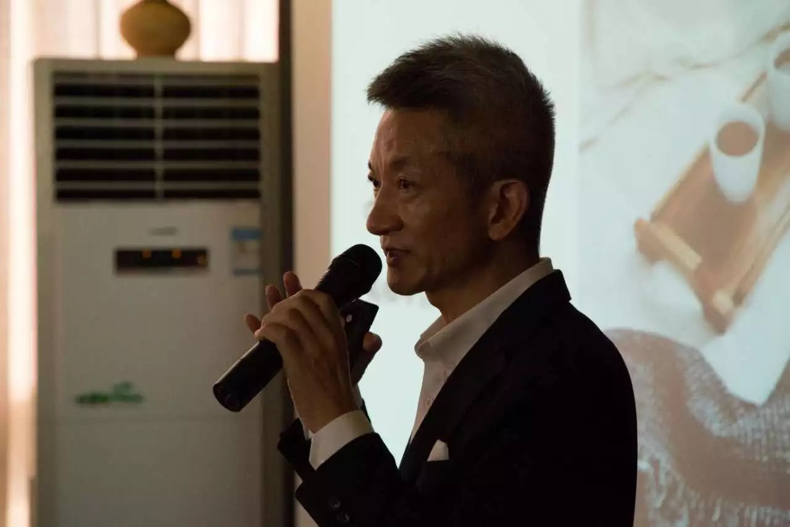
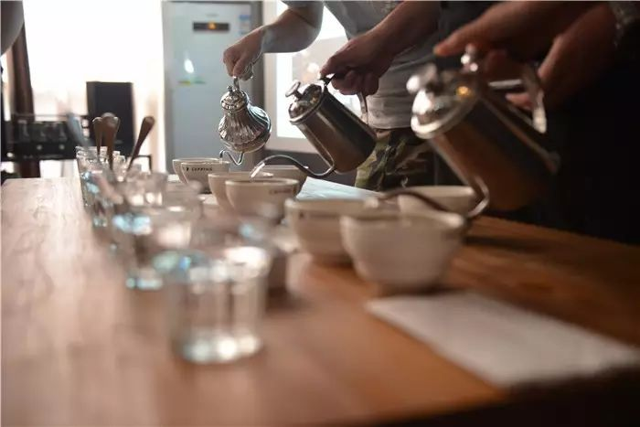
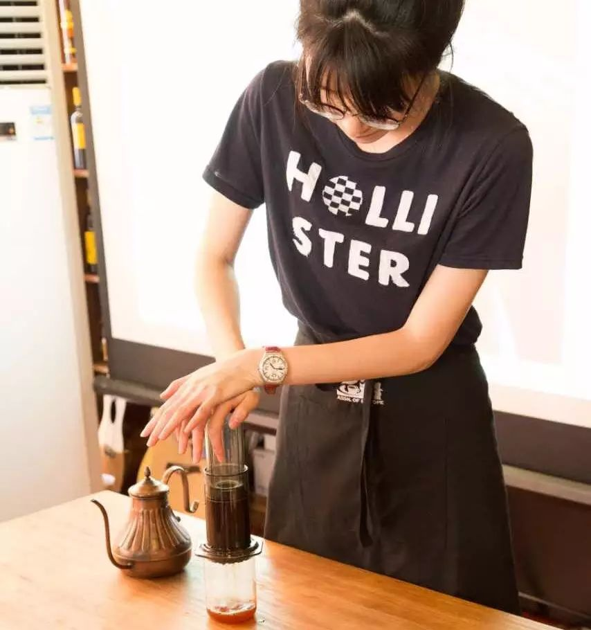
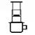
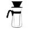
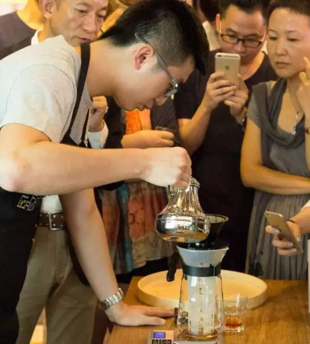
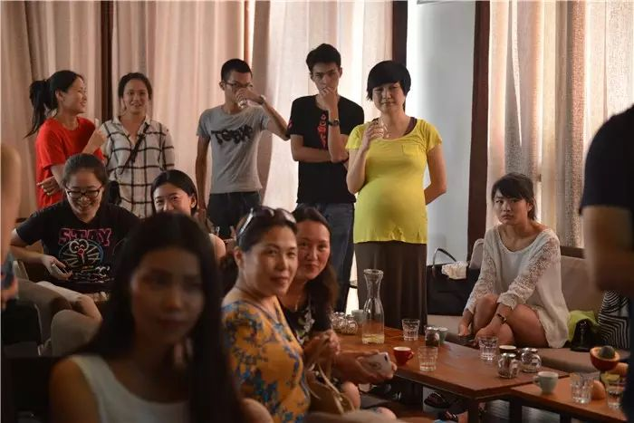
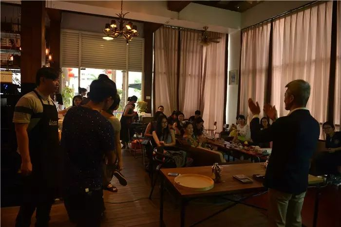
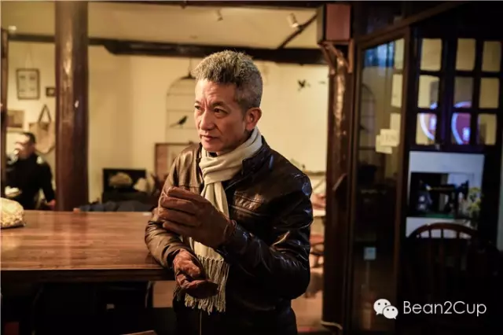

#  【我们想告诉你们】周六活动花絮

wen

__ _ _ _ _

【我们想告诉你们】

我们是咖啡培训及烘焙工作室，因为缘份开了对外的实体店，取名字叫Bean2Cup。含义很简单，就是寓意我们的咖啡豆从种子到杯子里，从幕后走到幕前。
秉着对咖啡豆的尊敬和热爱，我们认真对待每一粒豆子。
James说：“咖啡就像女人，不管是烘焙还是冲泡豆子，都要了解豆子的特性，热情，温柔，细水长流般对待。不然一不小心惹豆子‘生气’，就会有苦焦味出来，
不好喝。”

也想把这美妙的味道告诉大众所以我们举办了一场以认识咖啡为初衷为期三期，并以每一期知识递增的咖啡分享。以下是分享会花絮。

第一站  非洲

花絮

我们以非洲作为咖啡分享会的第一站。导师Bunco给我们讲起了咖啡的起源。其实有关咖啡起源的传说各式各样，不过大多因为其荒诞离奇而被人们淡忘了。但是人们不会忘记，非洲是咖啡的故乡。咖啡树很可能就是在埃塞俄比亚的KAFFA被发现的。后来，一批批奴隶从非洲被贩卖到也门和阿拉伯半岛。咖啡也就被带到了沿途的各地。

我们还讲起，  什么是杯测  。
所谓“杯测”、就像品选红酒一样以客观且总体地判断咖啡的甜味及酸味、苦味、后续余韵和香气、以及质量的优劣。通俗来说杯测是用一种特色的冲泡方法来品尝咖啡，任何人都可以参与，只不过咖啡杯测师会用更专业的打分表格来评价每一杯咖啡，给咖啡打分。

为何要杯测。
专业杯测师存在，利用专业知识来给咖啡豆打分。通过杯测来了解咖啡生豆的品质，来做为交易的依据，在精品咖啡的交易中，咖啡的杯中滋味决定着咖啡的价格。咖啡烘焙师，通过杯测来确定咖啡的烘焙度和咖啡出品的质量控制。还有就是细心的咖啡馆馆主也会用杯测来挑选供应商。爱好者也可以通过杯测来同事比较，了解几款咖啡豆的味道。

我们用三种不同冲泡器具冲泡三种不同的非洲咖啡，

让大家感受非洲咖啡的特点。

首先用的是爱乐压冲泡肯尼亚PB顶级圆豆，

让荔枝水果风味的甜度提升。

接着用手冲冲泡耶加雪菲G1，

传统手法让耶加的清新味道更绽放。

最后用冰泡冲泡坦桑尼亚AA，

让乌梅梅子的果酸更浓郁。

最后感谢大家抽空过来参加我们第一期的分享会

~想参加第二期的活动可留意本微信平台活动预告哦~

中南美洲

下期活动预告 第二站

咖啡探索之旅

咖啡的生长大地--中南美洲

咖啡的风味游戏

了解咖啡的烘焙度对风味的影响

中南美洲咖啡风味的特点介绍

冲泡体验

手冲咖啡初体验

全新冲泡体验

品尝三个中南美洲国家咖啡豆：

巴西国宝精品黄波旁

哥伦比亚顶级蕙兰

危地马拉花神

第二站举办时间：待定

讲师介绍
**王建涛Bunco**

SCAA美国精品咖啡协会及CQI国际咖啡品质鉴定学会认证国际咖啡品质评鉴师

SCAE欧洲精品咖啡协会授权培训师及认证考官

SCAE欧洲精品咖啡协会颁发咖啡专业文凭

HK中国精品咖啡协会总裁

深圳职业技术学院咖啡课程策划及客座导师  AFS国际文化交流组织义工发展委员  香港中文大学、香港科技大学等多间大学卓盟导师

B2C

