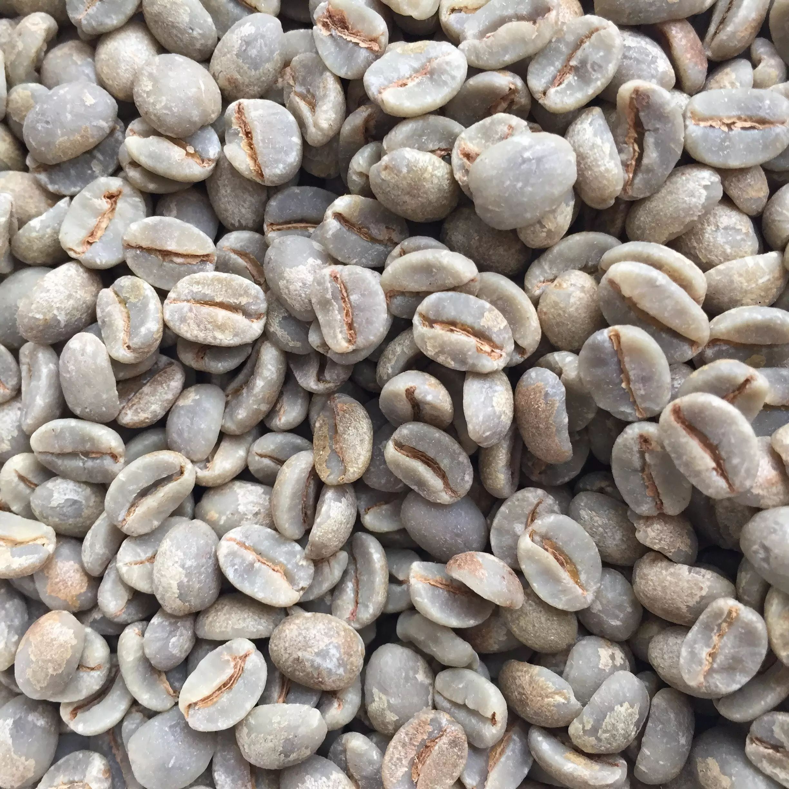
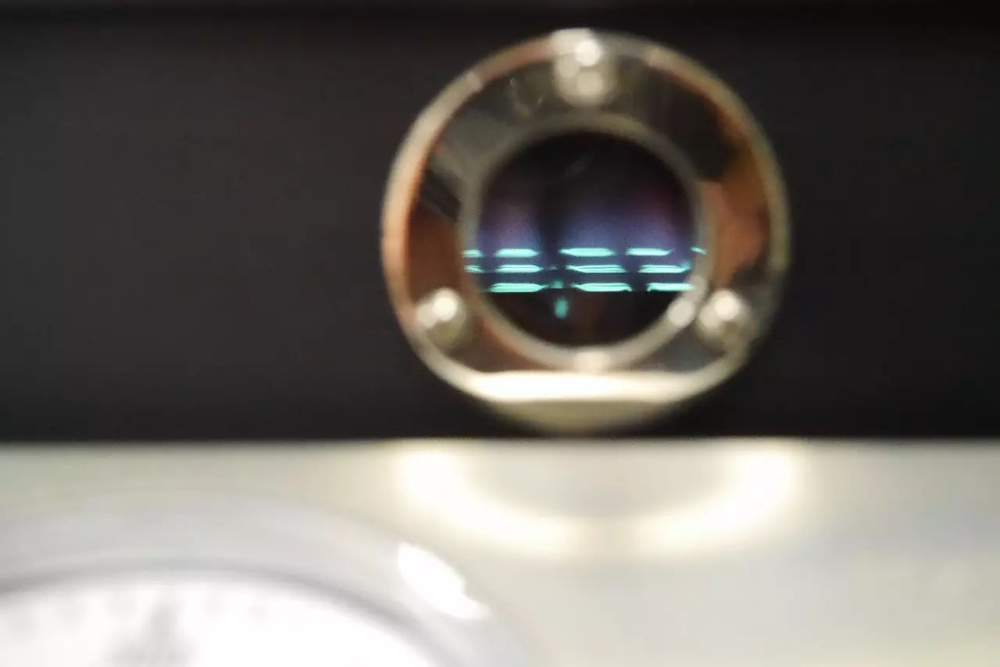
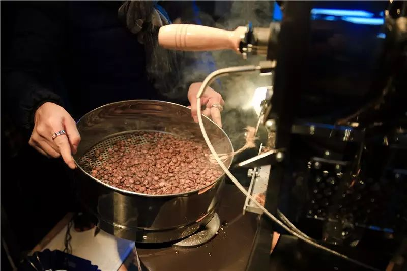
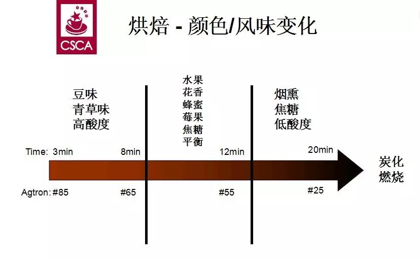
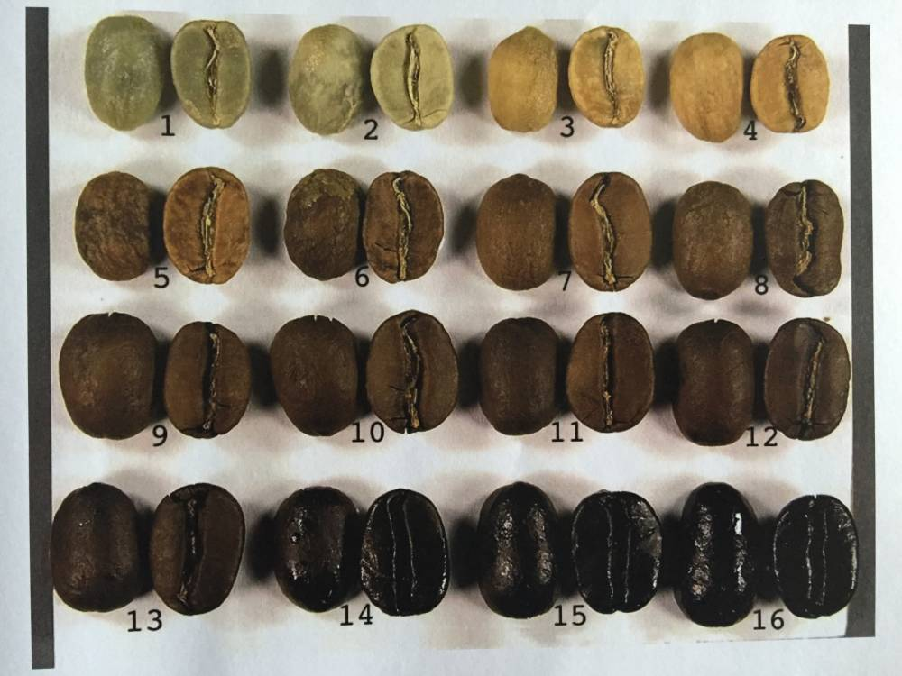
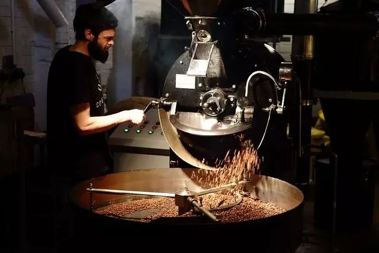
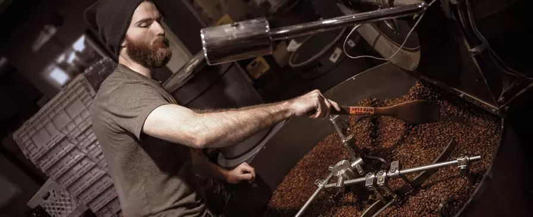
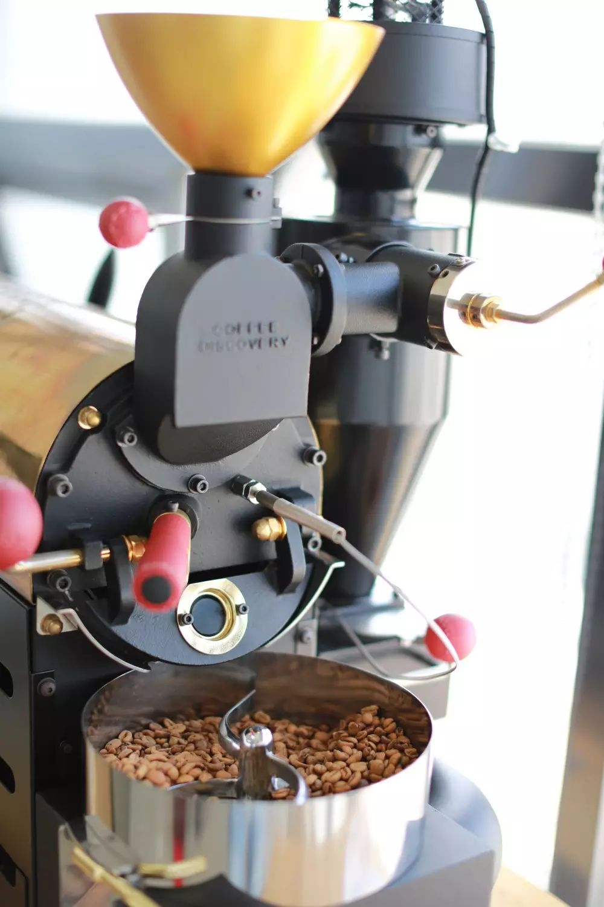
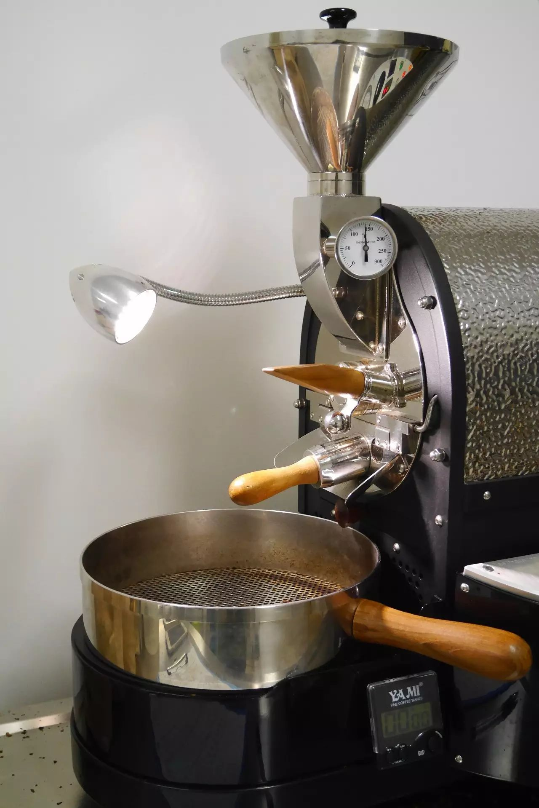
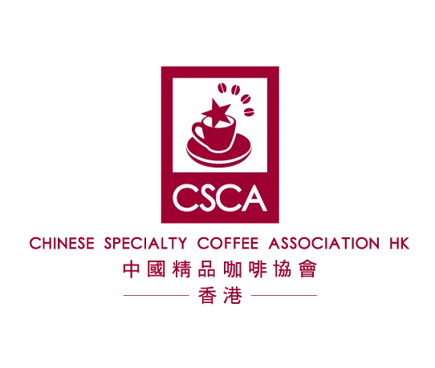

<!-- # 活动丨每周日，开放咖啡烘焙室 -->

---

葡萄酒是葡萄经过处理、发酵，酿造出来的酒类饮品； 而咖啡是咖啡豆经过处理、烘焙、咖啡师研磨、冲泡，萃取出来的咖啡饮品。

葡萄知道是什么吧，那咖啡豆到底是什么呢？

事实上，咖啡豆是咖啡果实的 **种子** ，有不同的基因（树种）和生长环境（产地）。 拿葡萄来打个比方，红葡萄、黑葡萄、白葡萄都是葡萄；
然而口味上却有着巨大差别，原因就在于它们的基因（树种）和生长环境（产地）不同。

咖啡豆也一样，树种和产地对风味的影响非常明显。

其实喝咖啡，你在喝的就是咖啡豆的味道！

△

生豆含有 2,000 多种物质

△

在高温烘焙的过程中，产生超过 1000 多种化合物

△

熟豆已被鉴定含有至少 850 种以上挥发性香气物质

烘焙是一门有趣而极富挑战性的手艺！
要了解生豆的特性，挑选瑕疵豆，掌握烘焙技巧，杯测检验，找出问题，调整烘焙曲线，将咖啡豆经过烘焙后发挥出最佳风味是每个烘焙师所执着的追求；但这并不是什么高深莫测的东西，了解这个过程可以让你更加清楚从种子到杯子所发生的变化。

△

烘焙师超酷的，有木有！

现在，每周日我们工作室的烘焙机将开放使用！

你可以在现场购买生豆，亦可以自带生豆，操作机器烘焙。

△

Fuji Royal Coffee Dicovery

△

Kapok-500

无论你懂烘焙还是没有接触过，都欢迎过来试烘焙。

现场将有专业烘焙师从旁指导。

费用：50 元/炉

第一期时间：11 月 22 日（星期日），需提前至少 2 天预约。

预约联系：18566767378 仙人掌（also wechat）

B2C

点击下方阅读原文可直接看我们的商店

感谢关注

