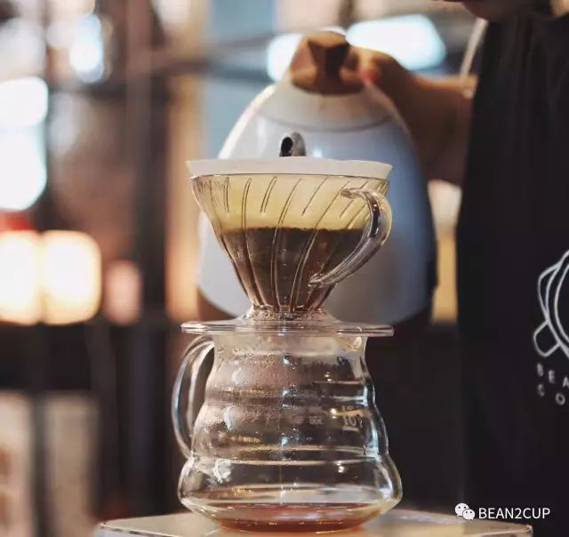
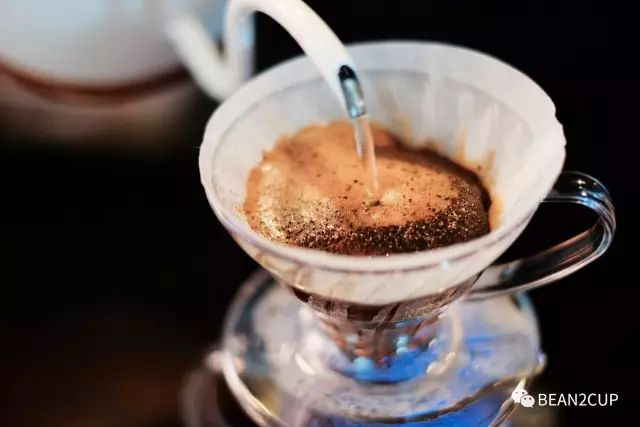
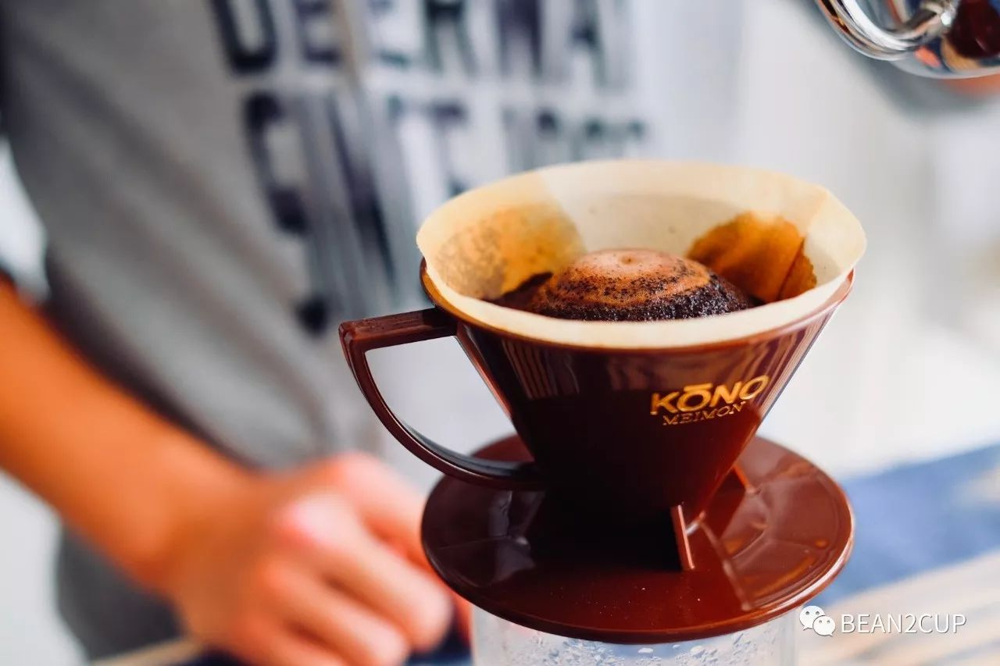
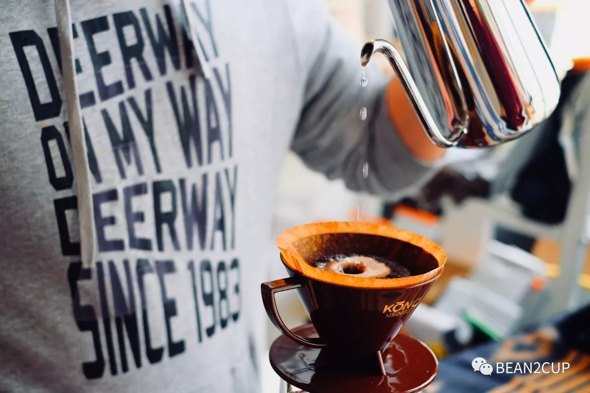
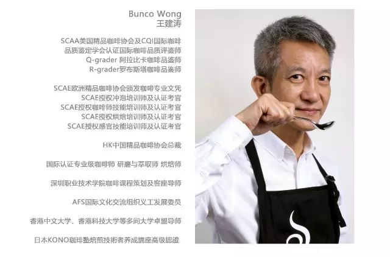
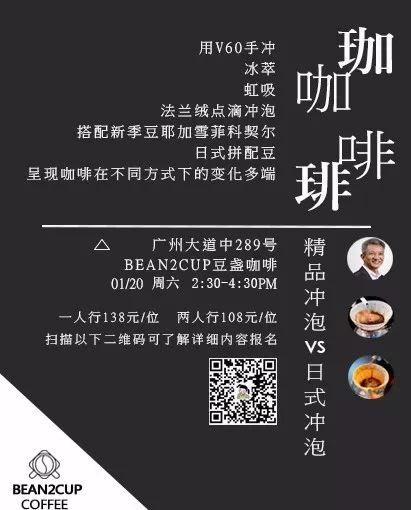
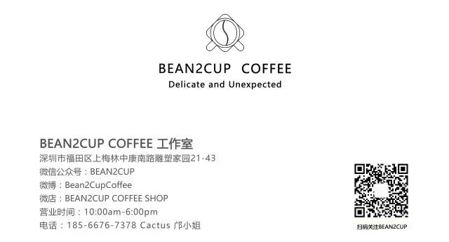
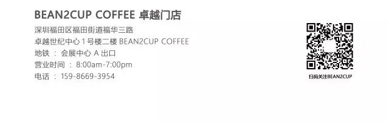
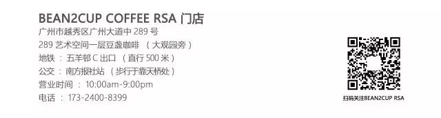
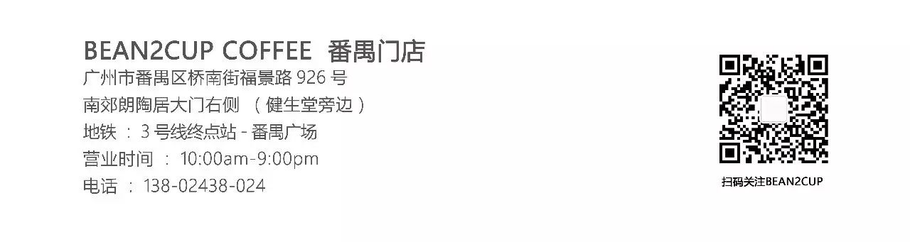

#  01月 活动 @广州丨精品冲泡 vs 日式冲泡

__ _ _ _ _

** **

冲泡咖啡，就像是对“独一无二”一词的解说

每一杯冲泡的咖啡，都有着或多或少的不同

不追求复刻 只追求好喝

**
**

** 精品冲泡  **

** ** ▲  ** **

以中度烘焙为主流，强调风味，口感清爽，表现花香及果酸。精品咖啡的品鉴类比红酒，讲究品种和产地的可追溯性，瑕疵率极低；更重视咖啡豆本身的“地域风味”，即土壤、品种、气候与水土不同造就不同的咖啡风味，这正正是精品咖啡的魅力所在。

** 日式冲泡  **

** ** ▲  ** **

以法兰绒点滴冲泡及虹吸冲泡为代表，口感醇厚，香气强烈，带有甘苦的余韵。日式冲泡以匠人之心经营，代代相传并不断精益求精，以不同拼配豆作为独家配方吸引着世界各地的咖啡者朝圣。

** **

** 本次体验活动  **

** ** ▲  ** **

将用不同工具，包括V60手冲、冰萃、虹吸及法兰绒点滴冲泡，以新季豆耶加雪菲科契尔及日式拼配豆结合多种器具为大家呈现咖啡在不同方式下变化多端的风味与口感。

** 分享讲师  **

** ** ▲  ** **

** ** Bunco Wong  ** **

** 【活动人数】  **

**** 对咖啡感兴趣的朋友

10-12人

**【地点及时间】**

广州豆盏Bean2Cup咖啡厅

2018年1月20号 周六 14:30-16:30

**【活动费用】**

一人行 138/人

两人行108/人

费用包含所需材料费

**【报名/咨询联系】**

微信客服：minru

报名电话：17324008399 /  13631401840

扫上面二维码了解活动信息

*活动最终解释权归BEAN2CUP所有。

B2C

**点击“阅读原文”即可进入Bean2Cup Coffee微商城**

预览时标签不可点

微信扫一扫
关注该公众号

****

****

×  分析

__

微信扫一扫可打开此内容，
使用完整服务

：  ，  ，  ，  ，  ，  ，  ，  ，  ，  ，  ，  ，  。  视频  小程序  赞  ，轻点两下取消赞  在看  ，轻点两下取消在看
分享  留言  收藏  听过

