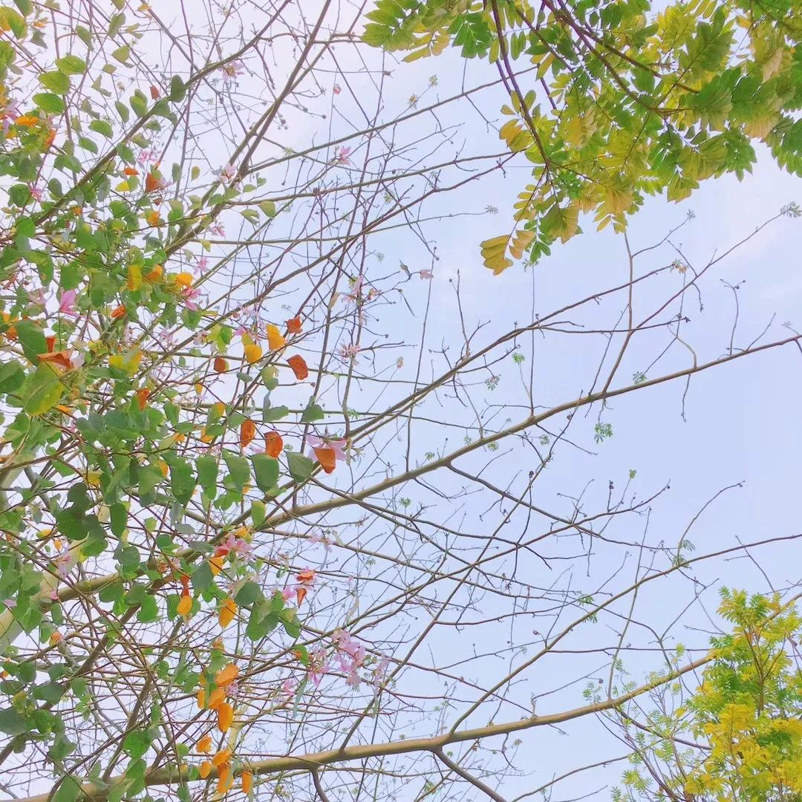
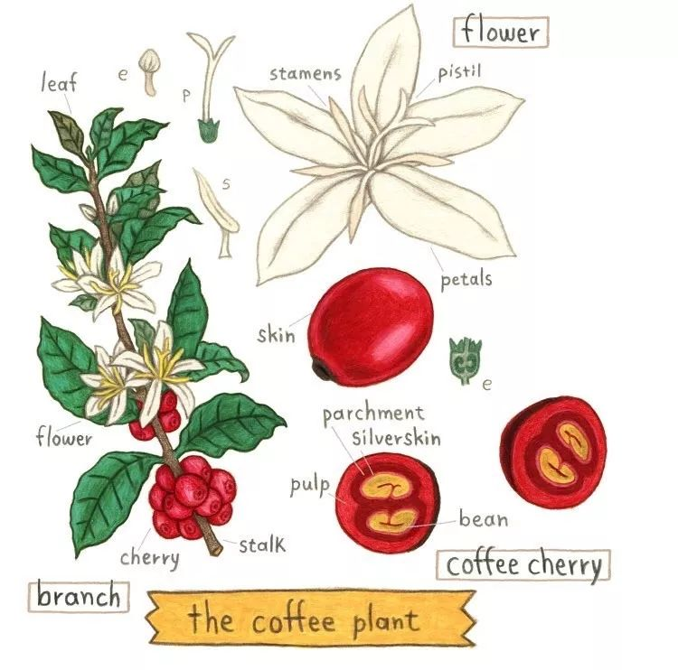
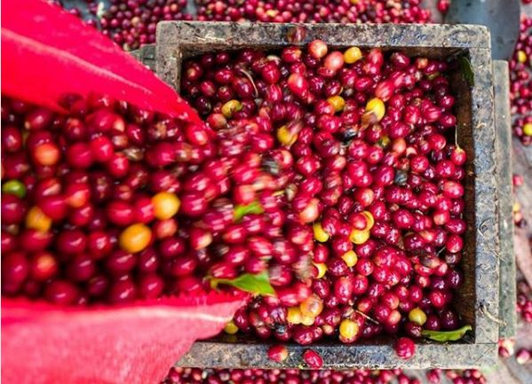
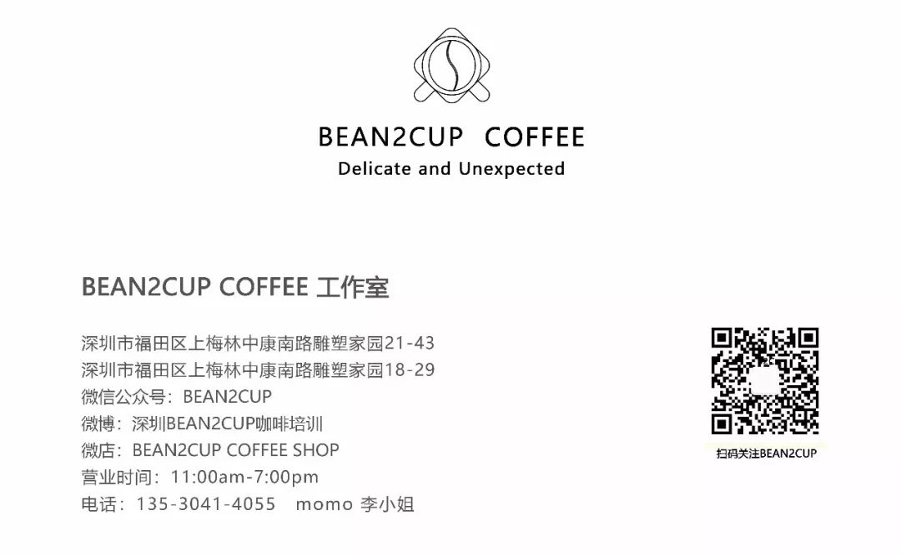

#  四月活动@卓越门店丨咖啡基础知识分享，从源头重新了解你的咖啡

__ _ _ _ _

四月

树杈上的新芽，街角的杜鹃，柔和的风，捉摸不定的天气，新一年斜照的光，微凉的夜...

善良的人和事都会聚在一起，我们一直觉得她是一年最好的开始。

四月的分享会，我们以咖啡的历史，种植培育，加工等等大家一般接触得比较少的部分作为主题。

常常接触咖啡的你，真的了解它吗？

这个四月，和卓越店的小伙伴们一起，我们不再拘泥于口味或产地，抛开繁琐的理论与学术，通过交流与分享，了解它和我们的渊源，它是怎么来到我们身边的，怎么发展的，怎么选择一杯适合并属于自己的咖啡。

** **

同时也会为大家分享几款不同冲泡工具的使用。

** 一杯咖啡的价格，一个下午的时光，从源头重新了解你的咖啡  **

费用：78元/位

人数：6-7人

适合：咖啡爱好者/零基础兴趣者

时间：4月22日下午3点  （时长约2.5小时）

4月25日下午3点  （时长约2.5小时）

** 以上时间二选一  **

地点：深圳市福田区卓越世纪中心一号楼2层大堂

Bean2Cup Coffee Dora门店

联系人：小鱼 13723777990

扫描以上二维码可直接报名

B2C

**点击“阅读原文”即可进入Bean2Cup Coffee微商城**

