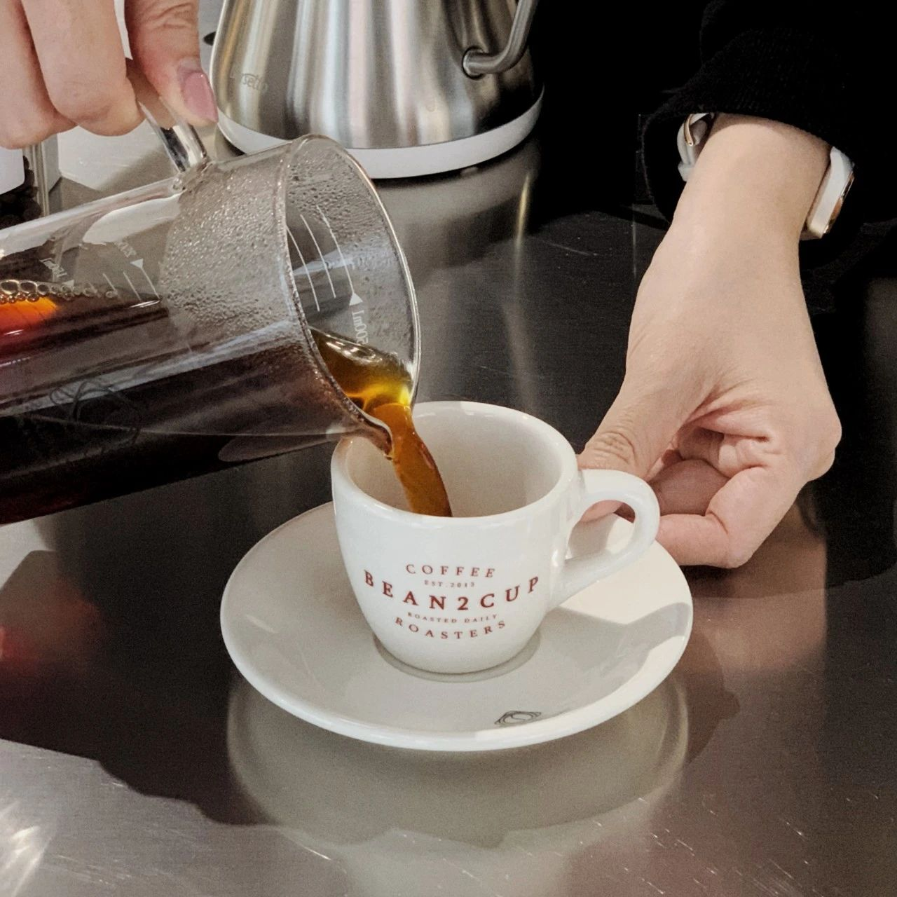
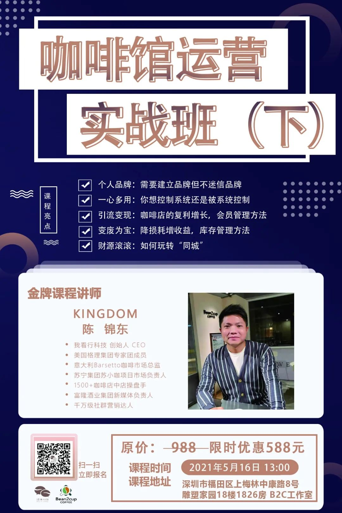
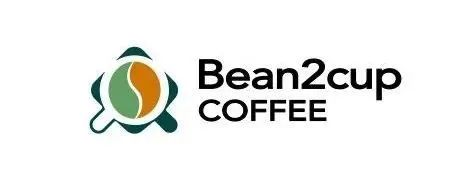

<!-- # 05 月 活动 @深圳 丨咖啡运营班：开咖啡馆不能踩哪些坑？ -->

原创 BEAN2CUP

---

**COFFEE**

【活动内容大纲介绍】

1.开一家咖啡馆如何实现长期盈利？

2.怎样用互联网思维经营实体店才能爆单？

3.咖啡香也怕巷子深！咖啡怎样做营销？

4.认知革命：开店的抉择

..........

**COFFEE**

【老师介绍】

KINGDOM / 陈锦东

我看行科技 创始人 CEO

美国格理集团专家团成员

意大利 Barsetto 咖啡市场总监

苏宁集团苏小咖项目市场负责人

1500+咖啡店中店操盘手

富隆酒业集团新媒体负责人

千万级社群营销达人

**COFFEE**

【活动适合人群 / 人数】

未来有经营咖啡店的计划，这个课程可以帮助创业开店少踩坑

现在正在经营的咖啡店遇到瓶颈需要帮助这个课程也可以帮助你学习咖啡店营运，提升咖啡店业绩

6-8 人

**COFFEE**

【地点及时间】

深圳梅林 Bean2Cup 工作室

（深圳市福田区上梅林中康路 8 号雕塑家园 18 楼 1826 房）

2021 年 5 月 16 号 周日 10:00-19:00

**COFFEE**

【活动费用】

课程原价：（上）988 元

限时特惠：（上）588 元

课程原价：（下）988 元

限时特惠：（下）588 元

** 限时特惠：（上）+（下）全课程 988 元 **

**(B2C 学员限时优惠折扣再享九** **折）**

**COFFEE**

【报名/咨询联系】

微信客服：MOMO

报名电话：13530414055

** 扫上面二维码了解活动信息 **

**★ ★ ★**

\*活动最终解释权归 BEAN2CUP 所有。

