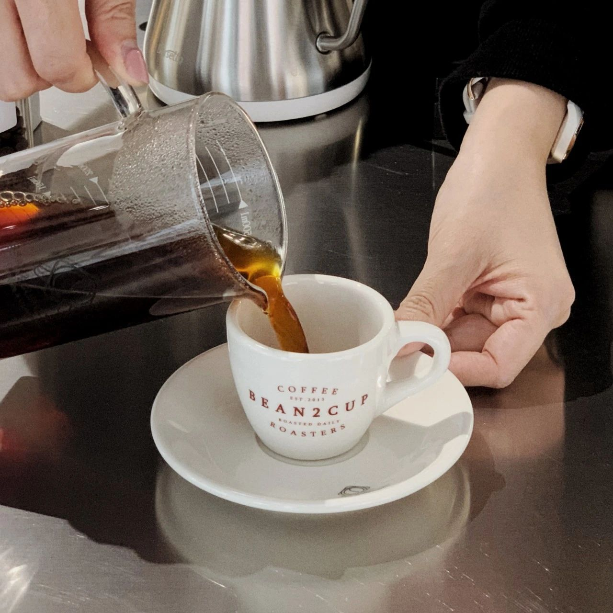
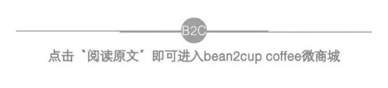

<!-- # 06 月 活动 @深圳 丨咖啡运营班：开咖啡馆不能踩哪些坑？ -->

原创 BEAN2CUP

---

**COFFEE**

【活动内容大纲介绍】

-你是否已经有一家店，面对“疫情”等突如其来的情况，无法正常经营，找不到办法？

-你是否想创业，但是犹豫再三，不知道从何开始？

-你是否想过开一家茶饮店、咖啡店、小吃店，但是没有人指导，又不敢加盟？

**COFFEE**

【老师介绍】

KINGDOM / 陈锦东

我看行科技 创始人 CEO

美国格理集团专家团成员

意大利 Barsetto 咖啡市场总监

苏宁集团苏小咖项目市场负责人

1500+咖啡店中店操盘手

富隆酒业集团新媒体负责人

千万级社群营销达人

**COFFEE**

【活动适合人群 / 人数】

帮你分析市场，让你少走弯路

学会算账，成本分析，如何做到尽早回本盈利

教你正确的会员运营方法，即使不能“正常开店”也可以爆单赚钱

花钱推广很容易，教你如何做到有效的营销推广，花小钱办大事

未来有经营咖啡店的计划，这个课程可以帮助创业开店少踩坑

现在正在经营的咖啡店遇到瓶颈需要帮助，这个课程也可以帮助学习咖啡店营运提升咖啡店业绩

6-8 人班

**COFFEE**

【地点及时间】

深圳梅林 Bean2Cup 工作室

（深圳市福田区上梅林中康路 8 号雕塑家园 18 楼 1826 房）

2021 年 6 月 27 号 周日 10:00-18:00

**COFFEE**

【活动费用】

课程原价：（上）988 元

限时特惠：（上）588 元

课程原价：（下）988 元

限时特惠：（下）588 元

** 限时特惠：（上）+（下）全课程 988 元 **

**(B2C 学员限时优惠折扣再享九** **折）**

**COFFEE**

【报名/咨询联系】

微信客服：MOMO

报名电话：13530414055

** 扫上面二维码了解活动信息 **

**★ ★ ★**

\*活动最终解释权归 BEAN2CUP 所有。

