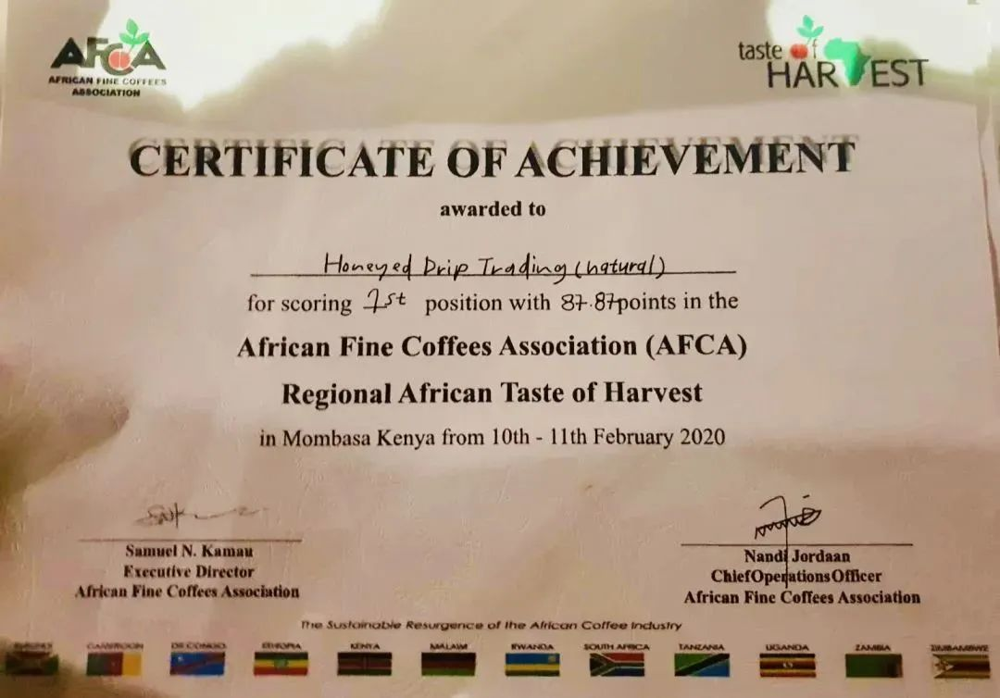
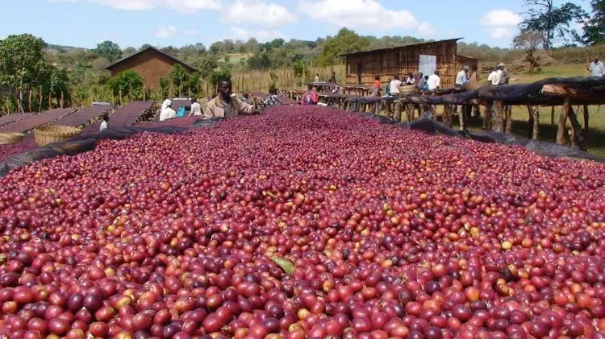
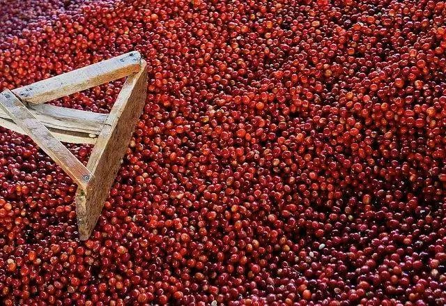
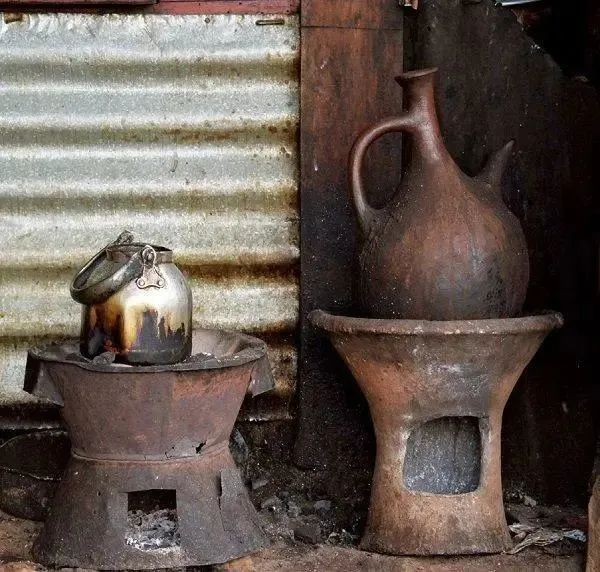
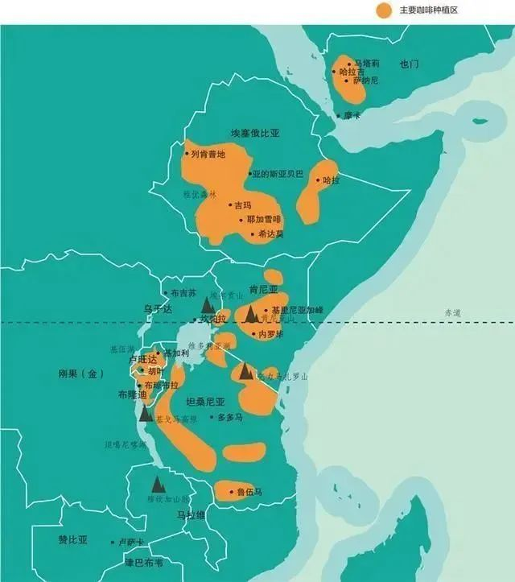
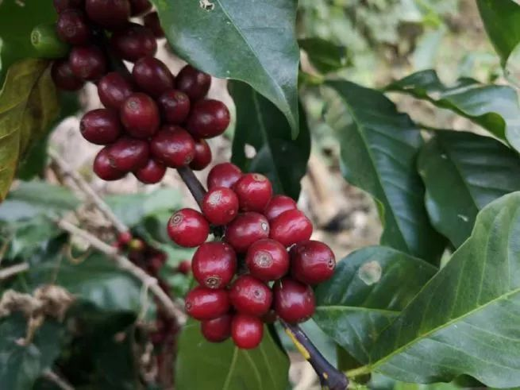
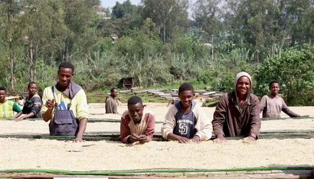
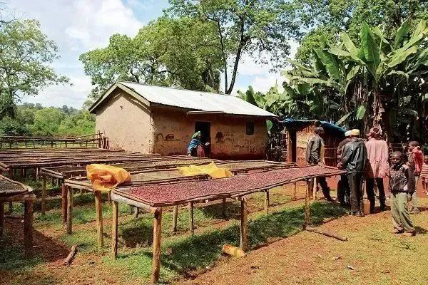
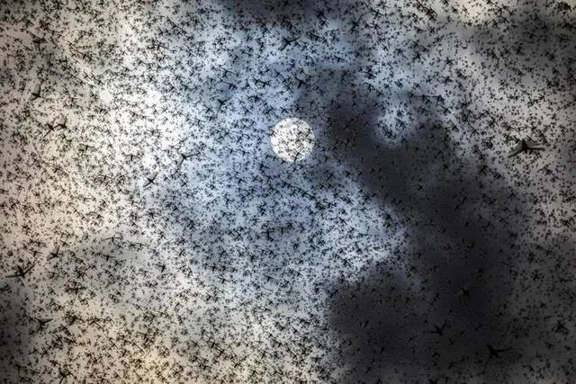
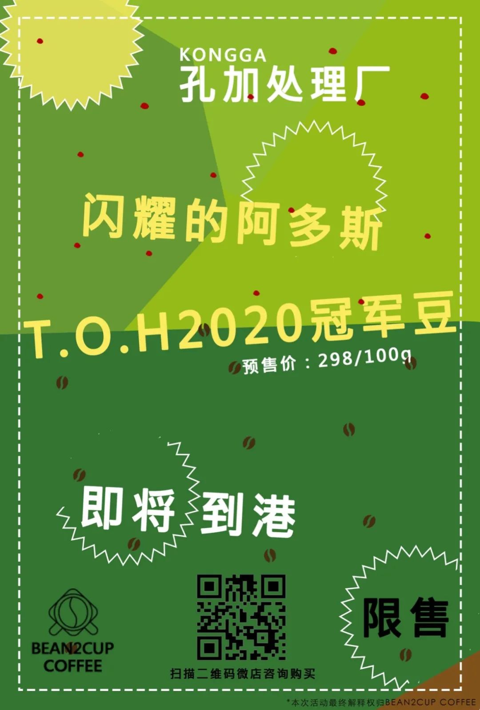

#  新豆推荐 | 双木成林----来自孔加木木的问候~

原创  momo

__ _ _ _ _

（画外音）在键盘上敲打的时候，窗外是一个倾盆大雨天，大雨洗刷了玻璃窗的尘土，更加舒适的温度也让手边木木更加宜口，香气肆无忌惮的布满工作室空间~

木木是在坦克、马可波罗、知秋、瑟瑟之后的第5个起名的豆豆，源于双木成林的典故，其实是momo最近喜欢上叠字名称，据说这样咖啡会变得很可爱。

第一次知  道  孔加  是17年看到角落咖啡箱里面包装袋，上面名字如此特别，打开发现还剩下最后一泡，赶紧拿出来。那时青涩冲泡也可以一下子冲出至今
我忘不掉的  清爽酸质感，那个酸度的清澈在我心里  打开个明亮角落，一种舒服自然的特殊柠檬酸悄悄留下来了；之后一直都没有  出现打动我的  孔加豆
，今年遇到木木就被折服了，木木保持孔加惯有的特色，一鸣惊人~

孔加合作社

Konga Coop

自从2008年ECX制度实施以来，大部份的咖啡生豆皆由此 制度竞贩卖，但是合作社并不在此管辖规范内，他们可以直接与买家接洽、议价与出口。
孔加合作社（Konga Coop）是耶加雪夫咖啡农合作社联盟（The Yirgacheffe Coffee Farmers Cooperatives
Union） （YCFCU）其26个联盟之一， YCFCU现代表超过5万个咖啡农民属于超过300,000个家庭代表， 成立于2002年6月，
全部26个联盟都落在埃塞俄比亚的南部基迪欧（Gedeo）地区上， 是埃塞俄比亚家非常有名咖啡重要产区。

孔加合作社（Konga
Coop）是由1,556名咖啡小农家庭成员组成，位于耶加雪菲（Yirgacheffe）南方5公里处，在1994年成立，于2002年加入YCFCU合作社联盟。
这些

咖啡小农的咖啡农耕种面积平均小于1.25公顷，种植海拔高度约1800至2000米
，咖啡品种主要是铁比卡（Typica）和Heirloom（当地原生种）混合  。
每隔一到两年，合作社的成员们会进行选举投票，选出执行委员会，而执行委员们可以决策新设备的采购案、与成员之间交换生意信息及交易的付款方式等。
另外，YCFCU也会指派专业经理人至合作社，针对收成、生产等程序给予指导与意见，藉以增加产量并提升质量。

合作社的成立，让旗下的农民们可以免于收购商的低价剥削，在经济有困难时，合作社也能提供贷款的协助，不管是对农民或是咖啡生产来说，都是相当有正面帮助的。

杯测

我们在杯测的时候，木木研磨后干香会带有丰富的热带水果味、茉莉花香会在研磨时偷偷跑飘出来；湿香变化更加丰富，特别是入口之后明亮的柠檬酸和蜂蜜甜，柠檬茶一样的新感觉；日晒处理也带出似莓果的甜感，
口感整体贼儿饱满，全程满分~  最后我们集体投票木木，4vs1完胜~

木木就是来自埃塞俄比亚孔加的”咖啡树“，来到这里深深扎入了我们心中明亮的地方，她那小小的身体里蕴含了来自埃塞的热情，孔加的阳光，饱实的口感和特色的风味~

双木成林，大家心里都有专自己属的一片咖啡林，期望孔加木木也能够加入到那片咖啡林里，给大家带来那般甜而不腻，舒服的咖啡~

（以上部分内容及图片引用自网络）

咖啡豆已上架

挂耳包同步上线

