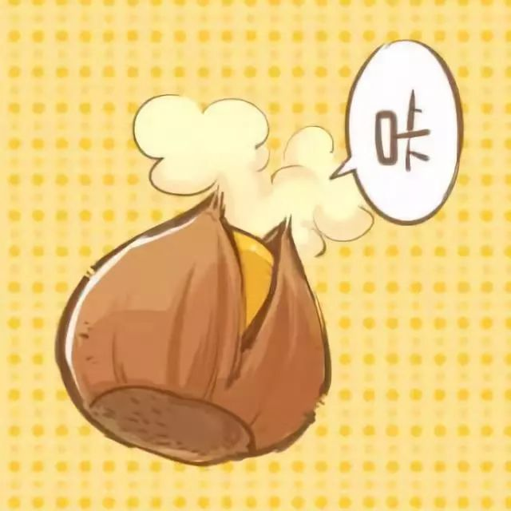
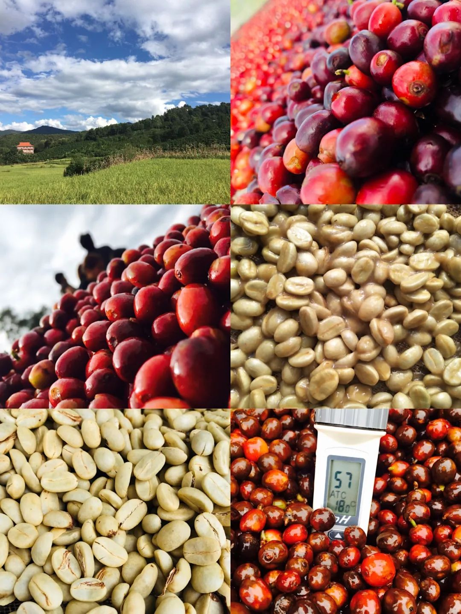

#  秋季豆单--10月推荐

原创  BEAN2CUP

__ _ _ _ _

在广东这个四季如夏的地方，我们虽一如既往身处炎热，但也能在空气中闻到一丝丝秋季干燥的气息。秋天特别带有枯叶垂落芳香的干燥空气，不免让人联想起甜甜的炒板栗～

这个十月，想要给大家推荐的豆单里，其中一款就是--  板栗

推荐豆单--壹

“板栗“的故事：

以“板栗”命名这款咖啡的名字，是缘于一位来自云南普洱的姑娘：板栗。

\--这是我第四次因为咖啡来到云南。自第一次因为咖啡踏足普洱，便深深地喜欢上这个地方。普洱给我的印象，天气总是那么干爽、阳光四溢，不似南方广东的闷热潮湿。还有那些在大城市里极难或根本没机会吃到的“真材实料”的食材。
每一次到来，都加深了我对这个地方的喜爱，每一次更加的喜爱是因为这里遇见的人、事、物，以及咖啡的故事。

遇到板栗，是在云南国际咖啡博览会的工作后和云南朋友的午餐上。就餐时她就坐在我左侧的位置  ，二十出头的她
内敛沉默，整顿饭下来我们也没有过交流。之前三次来到普洱，也都去了庄园和咖啡处理厂，但主要在于了解咖啡采摘的过程和近两年处理方式的变化和进步。这顿午饭期间，从咖农、庄园主的交谈，让我更进一步明白到种植咖啡的不易及咖农、庄园主在咖啡市场贸易上所面对的打击。

午饭结束后，我们一行人来到处理厂参观，在这里除了有大型的脱壳处理机，二楼还有有一个杯测房，在阳台还有一个小烘焙间—板栗平时就是在这里烘焙豆子的。在杯测房待了一会，看到板栗在外面的烘焙间准备烘焙测试样品，我忍不住向前跟她搭话。才发现一聊起咖啡，板栗从沉默内敛变得爽朗热情，完全颠覆了午餐时对她的印象！短短的几个小时内，板栗向我们分享了很多关于咖啡的东西，包括自己第一次在普洱开咖啡店的经历，处理生豆时所遇见的经验和有趣的事情等等。。

发现“板栗”

板栗烘焙完样品后，我们顺带做了几款豆子杯测。  其中有一只水洗豆让我们都很惊艳！带有橘子、甜橙、麦芽糖、坚果、还有淡花香...
还对这只水洗豆子的产区提出了疑问。  最终杯测结束后，板栗告诉我们，这就是今年他们参加云南生豆大赛的豆子，
这只豆子就是2019年云南生豆大赛的第二名获奖豆！而板栗就是负责这款豆子处理的伙伴。

“板栗”由来：

从云南回来后，我们毫不犹豫地定了这个云南生豆大赛第二名的豆子，
一开始我们总把豆子叫为：云南生豆第二名。觉得这称呼实在有点别扭，就想给它起个名字。思来想去，觉得“板栗”是最合适的。
板栗，让我看到了她及其他咖农对咖啡的执着和热爱，也看到了云南年轻伙伴投身于咖啡，想要改善云南咖啡现状的决心和态度！
在征求板栗的同意后，我们把云南生豆第二名取名为：“板栗”。

全红咖啡果实（右一，左二） 带果胶发酵中的羊皮豆（右二）发酵完清洗后的羊皮豆（左三）

在Bean2cup的豆单上，“板栗”这款豆子不算最新上线的，或者有很多朋友在门店喝到过或买过好几次的豆子，今天把“板栗”的故事分享给大家，
希望能将这么好的中国云南普洱咖啡带给大家，让大家知道中国云南咖啡近几年的进步有多大！让很多曾经对中国云南咖啡带有偏见的人通过品尝到好的云南咖啡而改观！
让更多的人知道，云南普洱除了好茶，还有好咖啡！  一起来感受中国咖啡的魅力吧！

* * *

推荐豆单--贰

介绍完一款出色的中国云南咖啡豆，接下来想给大家推荐的是一支来自  南美洲的特别处理法咖啡豆：  X.O  。
近年来在传统处理方式上进行改变的不同特殊处理法越来越多，而咖啡豆也因为这些特殊的处理方式而产生较大的风味变化，丰富其味蕾的触动。但是不是所有的特殊处理法都能达到很好的效果？

-特殊处理法-

大多数的特殊处理法，借鉴了酒的发酵原理，控制发酵物的氧气量，从而达到更稳定控制发酵  时间、温度及其干燥时间等。
也有将咖啡豆放置于酒桶中进行无氧/低氧发酵，使得去皮咖啡豆与酒桶内的酒香混合，让酒桶香气浸入咖啡豆中，使得咖啡豆获得更丰富或原本通过传统处理方式不会产生的咖啡风味。

这样的特殊处理方式，需要一定的处理技巧及制作成本更高。也并非每一支豆子都能通过这样的处理方式获得更好的风味。

\-  豆子介绍  \-

继一经推出很快售空的“朗姆酒桶处理法”之后，很多喜欢这个豆子的小伙伴都问：什么时候会有新的呀？

本期推荐的这支特殊处理法咖啡：  X.O  ，是平衡度极好的特殊处理法咖啡。也是
Bean2cup小伙伴们经过多次寻觅杯测再次良心推荐的特殊处理法咖啡豆。不同于“朗姆酒”明显跃出的兰姆酒酒香、巧克力香气尾韵，
X.O入口时带有干邑白兰地的李子、焦糖、香草杏仁的香气风味，以及百香果细腻酸质和醇厚顺滑的口感，干邑白兰地的酒香在咖啡液体咽下后，在喉咙上的位置缓缓而上。这支咖啡良好平衡度，也让咖啡温度从热到凉都保持了高度的一致性。

喜欢风味层次丰富、带有酒香、口感醇厚的爱好者可不要错过哦！

红酒日晒处理  ：  带果皮在食品用塑胶桶中通过单向阀排出氧气进行厌氧发酵  10  日，进入富二氧化碳状态浸渍，后移入棚架进行均匀干燥。

* * *

** -10月优惠-  **

即日起至11月05日于微店购买单品咖啡豆满286元，即可享受包邮活动哦！

微店包邮活动期限：2019.10.15-2019.11.05

/  10月咖啡豆单推荐  /

更多内容 敬请期待

