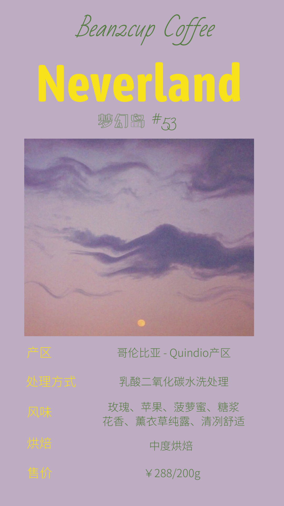
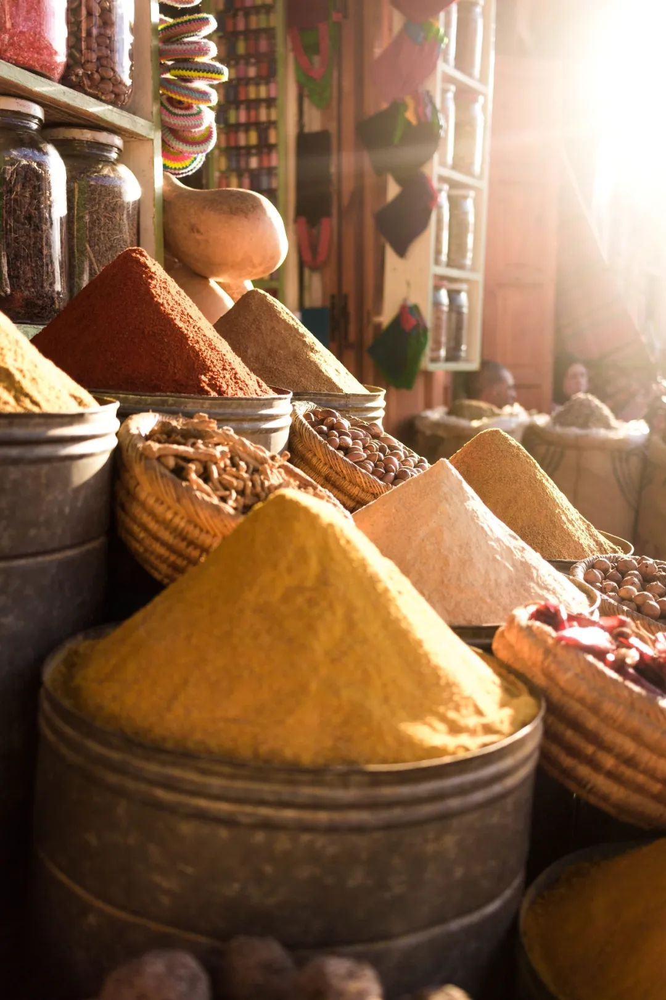
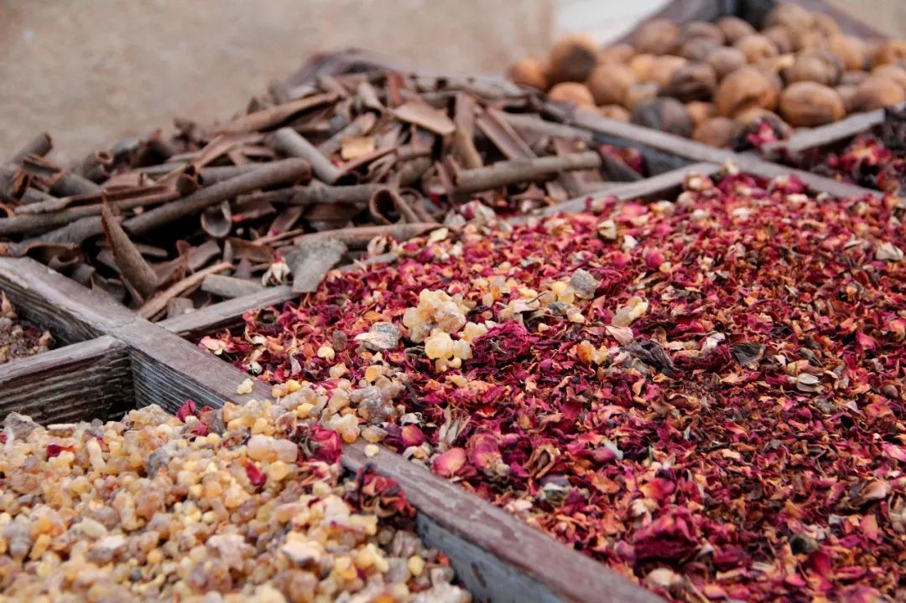
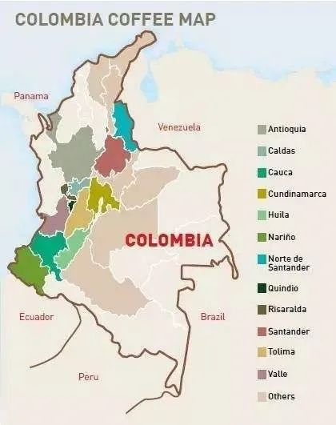

#  新豆推荐 | 来自哥伦比亚Quinido省的热烈想象力-Neverland

原创  Cara

__ _ _ _ _

Sleepyhead under a violet moon
在紫罗兰色的月光下昏昏欲睡
Moroccan moonlight in your eyes
摩洛哥的夜晚陷在你流转的眼波里

这一期Bean2cup要为大家带来的新豆,

我们给它取名  **Neverland（梦幻岛）**

实验批次的特殊处理

近年来特殊处理⽅式带来的特殊⻛味越来越受到欢迎，相信⼤家也喝到过很多不同的特殊处理⽅式的⾖⼦。

同样特殊处理⽅式也⼀直在接受科研的挑战。我们接下来介绍的这⼀款⾖⼦采⽤厄⽠多尔La Florida农场到哥伦⽐亚的乳酸菌加⼯⼯艺的咖啡，带出令⼈惊艳的⻛味。

处理⽅式：发酵前15天收集并培养乳杆菌，然后采摘咖啡果实后脱⽪，保留果⾁将乳酸菌和草本果汁混合⼀起添加（灌注技术），根据⽓候和⼆氧化碳注⼊量并将pH保持在3.7。浸渍42⼩时后⽔洗，并置于树冠下晾晒18天⼲燥。

文末有惊喜彩蛋！！！

杯测的惊喜

杯测的时候，干香是很浓烈的辛香味，像川西高原上清冽的野山椒，又仿佛像一头撞进了摩洛哥的香料市场，堆得高高的五色香辛料，耳边响起电影《卡萨布兰卡》的主题曲。

沙漠里温和的午夜太阳照耀着的黄昏之地，渐凉的沙丘，微微炙热的手。这里香辛料的存在丝毫不会突兀，很平和，就像一阵热风，热烈的吹过皮肤，展开你蔓延的想像。

* * *

** 中低温的优秀表现  **

随着咖啡的温度一点点回落，法国南部某庄园的薰衣草气息传来，起初像在北非沙漠篝火旁手抓一把干薰衣草的法国少女，慢慢地，后味转暖变成甜而潮湿的薰衣草茶伴随着玫瑰与苹果的香气，像极了田园气息的南法。

有了这杯Neverland，今年秋冬清冷的夜晚就变得热情又安然。

* * *

** 关于Neverland的出身  **

Quinido产区是哥伦比亚国家咖啡公园所在地

采收期：9月-12月（主产季）4-5月（次产季）

品种: 卡杜拉 铁皮卡 Castillo

海拔：1400-2000米

** 哥伦比亚咖  ** ** 啡  **

哥伦比亚是世界第三大的咖啡出口国，主要出品阿拉比卡咖啡，也是出口最多阿拉比卡豆的国家。

哥伦比亚位于南美大陆的西北部，与中美洲巴拿马接壤。相传咖啡是传教士于1730年由委内瑞拉传入，并于该国东南方种植。后因内战和政局原因渐向西部山区转移。在高度和火山土的理想栽种环境下，为咖啡提供了一个真正意义上的“天然牧场”。

哥伦比亚咖啡经常被描述为具有丝一般柔滑的口感，在所有的咖啡中，它的均衡度最好，口感绵软、柔滑，可以随时饮用，它获得了其他咖啡无法企及的赞誉：被誉为“绿色的金子”。

从俯瞰图看，它的西边就像被猫抓了一下；由北至南，留下了三条垂直的爪痕。该国有名的产区，就是散落在这些带有肥沃火山土的安第斯山脉当中。

关于Neverland的一些臆想

1942年二战期间，许多欧洲人逃离到美洲，而摩洛哥作为未被占领的中立区，成为流离失所人们的中转站。他们需要得到一张通行签证才能到达他们所认为的自由之地。
这就好像这支豆子带我们走过的旅程一样，带着法国潮湿的浪漫主义，略过神秘的北非沙漠，到达南美洲那片热情丰饶的土地上。
其实自由理想之地不在于时间与空间，只要是心之向往终能到达你心中的Neverland，大人们以为不存在的地方。那里空气纯洁孩子不会长大，小妖精只知道飞来飞去炫耀美丽；爱恶作剧的彼德潘整日不知疲惫。那里的世界相信童话，美好的心愿都被珍藏。

Neverland在天上，要在有皎洁月亮的夜里，等待彼德潘带着有魔力的飞行粉到来，他从大开着的木窗口路过，他把唯一的请贴给了温蒂摩尔安琪达玲。

愿我们在梦里都能收到彼得潘的邀请函，到达心中的梦幻岛（Neverland）

文末彩蛋

** 扫描二维码即可进入购买页面  **

** / 良心推荐咖啡清单回顾 /  **

[ 忆Cafeex咖啡节：一个旋转的陀螺是瞎晃悠，一群旋转的陀螺就是能量场。
](http://mp.weixin.qq.com/s?__biz=MzAwNTYzODcxMg==&mid=2651350415&idx=1&sn=ae14b0ef454489ca5add65038bb2ef7c&chksm=80e55ad8b792d3ce64fafd86bb6f85c2e422c8c213320e40c30e56b003260fa5d92f6f9f9a40&scene=21#wechat_redirect)

[ 恭贺迁居之喜，室染秋香之气
](http://mp.weixin.qq.com/s?__biz=MzAwNTYzODcxMg==&mid=2651350451&idx=1&sn=e065cddd2acb88ac359fb5d608712e33&chksm=80e55ae4b792d3f2a29b29326682621b4840828707509486ec18dfcccd658f800f040cdbed7d&scene=21#wechat_redirect)

[ 2020 | 让我们带上咖啡一起共度时艰吧~  ](http://mp.weixin.qq.com/s?__biz=MzAwNTYzODcxMg==&mid=2651349414&idx=2&sn=dfbf7106da5bc36f6ac25d43b5d426d8&chksm=80e55ef1b792d7e74f80effa2d55c994bddc40e9503e7d0feb95d525c234638e6f68df04e39a&scene=21#wechat_redirect)

[ 新豆推荐 |三木成森---闪耀的阿多斯
](http://mp.weixin.qq.com/s?__biz=MzAwNTYzODcxMg==&mid=2651349607&idx=1&sn=dfcca484662902e10d4cd7164de68e9d&chksm=80e55d30b792d426128198e73a98bebb8f5168e2271b62e44674339d030fc62334973d26cee5&scene=21#wechat_redirect)

[ 新豆推荐 | 一颗努力来到我们身边的玻利维亚小甜心~  ](http://mp.weixin.qq.com/s?__biz=MzAwNTYzODcxMg==&mid=2651348594&idx=1&sn=84c36c440726b2db16e8d6c994ed6472&chksm=80e56125b792e833ca2a1970b595a4dd4068f8b03b9ae052a2672cb2286e34e1c4da45e79898&scene=21#wechat_redirect)

