# 春日新豆推荐/卢旺达-山竹

原创 Cara

---

**春日新豆推荐**

**山竹**

产地：非洲 卢旺达

海拔高度：1710 米

处理方式：蜜处理

烘焙度：中度烘焙

品种：红波旁

风味描述：山竹、枫糖、油桃

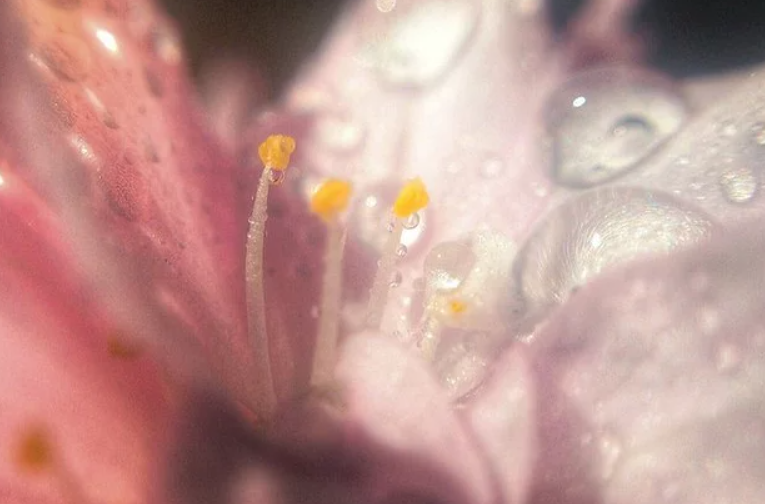

有一种力量

来自万物之始

来自生命初绽的骄傲

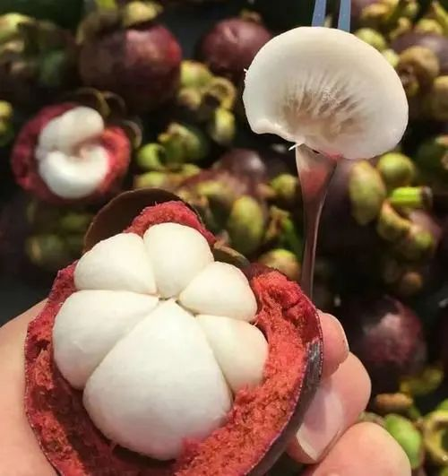

SPRING

和煦春日

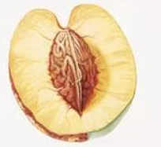
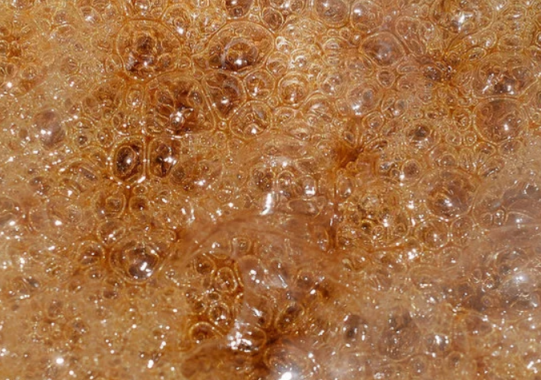

**RWANDA 卢旺达**

**“** 千丘之国”“Land of a Thousand Hills **”**

咖啡由德国传教士于 1904 年带入卢旺达，

卢旺达又 被称为“千丘之国”，

境内有种植出优异咖啡的维度和气候条件。

卢旺达西部省路特溪洛产区所生长的

波旁咖啡是阿拉比卡咖啡的原始品种之一。

多数热爱卢旺达咖啡的原因是它的糖浆、

醇厚的口感.这种甜美、浓郁的特征部分

归功于咖啡的品种 Bourbon（波旁）

卢旺达跟很多非洲国家一样以小农生产为主，

咖农们徒步将新鲜的咖啡鲜果集中送到处理站。

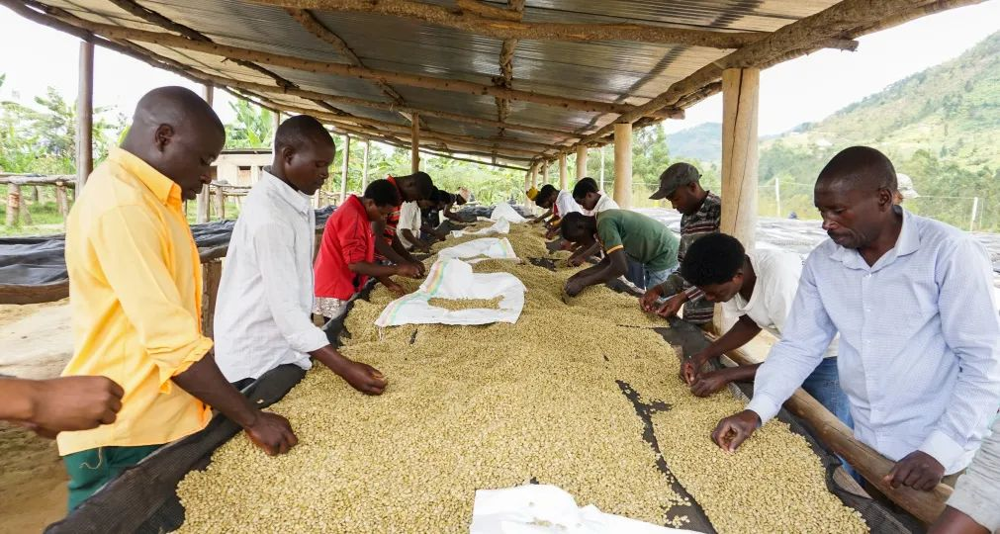

蜜处理的咖啡果在挑选后会被移至晾晒床上，

在日晒干燥过程的每一天，都会进行人工手选，

确保可见的瑕疵被去除。

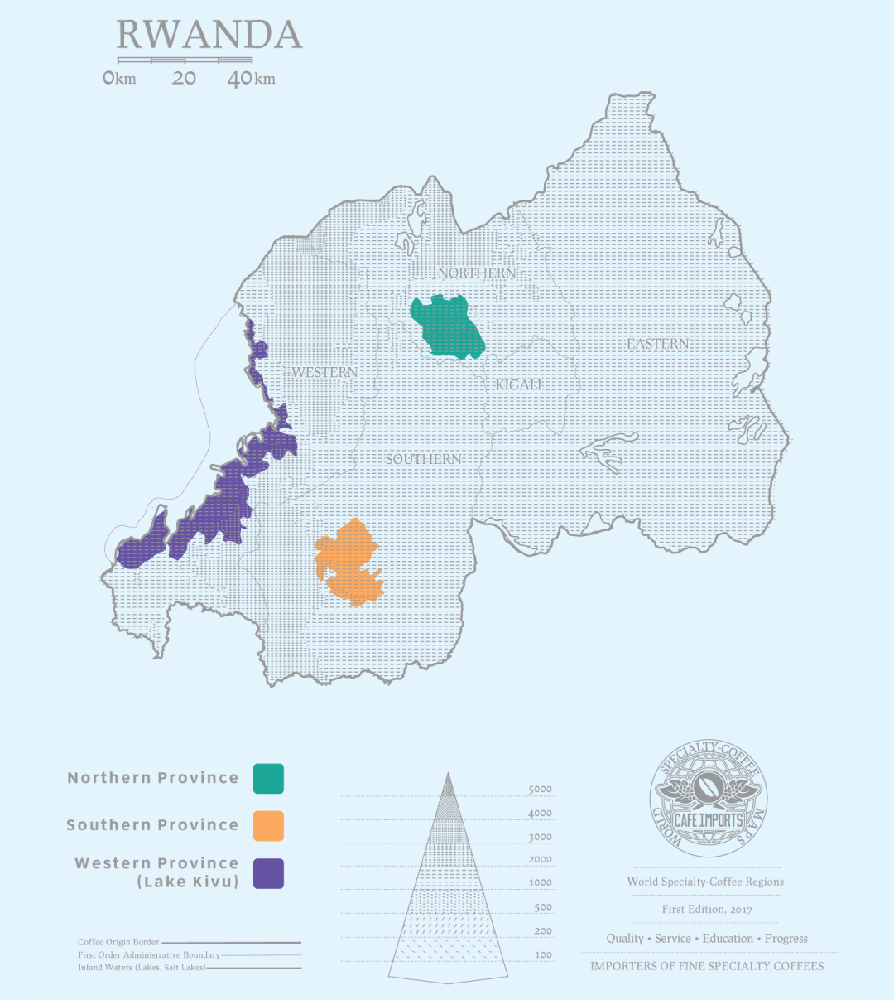

在卢旺达你会发现各种各样口的咖啡味:

樱桃，葡萄，柠檬，巧克力，香瓜，

橘子，油桃，糖果，杏子，李子，等等。

除了干净、清爽、柑橘的酸味，

枣味也是卢旺达咖啡风味的特种之一。

这些果味特征来自这个国家良好生长环境

在卢旺达，大约有 40 万小农生产者，

大多数农场海拔为 1700 - 2000，

高海拔增加了咖啡风味的复杂性。

**奇妙的香气**

星期六的早上 9 点，乡间的一个果园里，

两个卢旺达女孩偷吃着一块传统的枫糖磅蛋糕，

亮黄色的裙摆上还留着一片片春日的花瓣。

卢旺达的这支豆子，整体感觉很温柔很舒服。

淡淡的山竹味道， 像一颗

白嫩饱满水润的山竹果， 想一口咬下去。

干净的油桃花香，

少许枫糖的天然甜感夹杂其中。

雨过天晴，蜂鸟在油桃树下跳跃。

远远油桃树的香气，

与一股子山竹花的酸甜味纠缠在一起。

像是少女置身于清晨的大树下，

果香不会太甜，很清新很温柔，

却又很饱满很水润

细细的品尝，能渐渐分辨出其中的果香

和淡淡的花香。像一个温柔阳光，

真诚直率没有心机， 亲和的少女。

怀抱对春天美好的愿望和憧憬，

“有一种力量，照亮内心的力量，

它来自万物之始，来自生命初绽的骄傲”

在这春意盎然的日子

Bean2cup 为你呈献这只温柔的豆子

祈望啡友们春日有光！

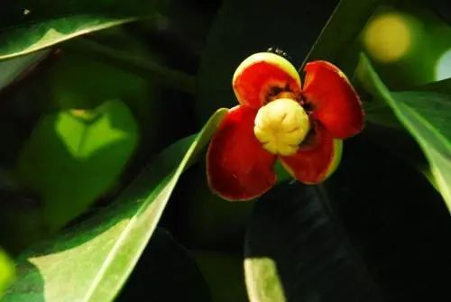

山竹花

与油桃花的纠缠

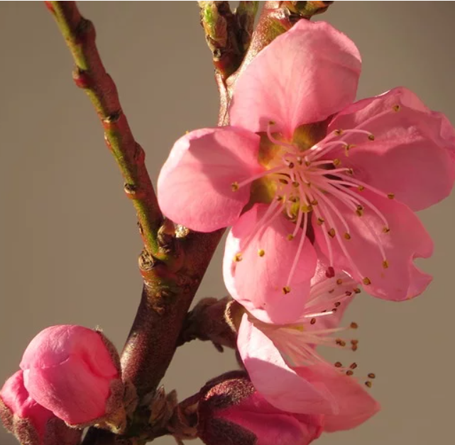
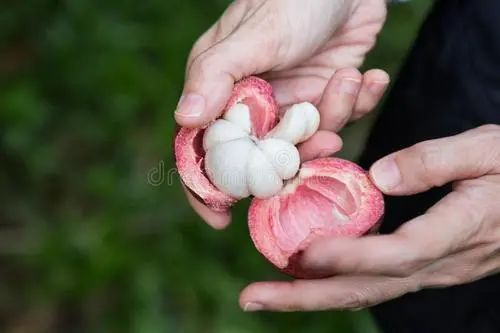

**_SPRING 春日_ **

**冲煮建议**

\*\*
\*\*

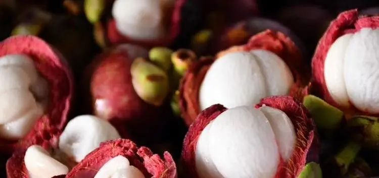

冲泡建议：

水温 92 度-93 度

水粉比例 1：15-15.5

卢旺达所生长的波旁种咖啡的冲煮

风味带有明显的水果酸甜，平衡顺滑，

有着可口的甜香和平衡感。

就像咬一口鲜甜多汁、酸甜可口的山竹。

Life

生命的绽放

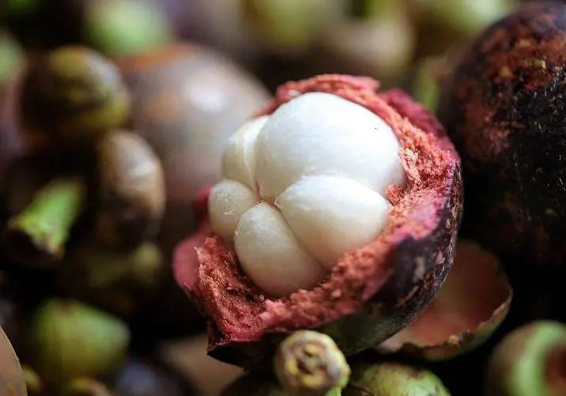

**Bean2cup coffee**

点击左下角“阅读原文”

即可进入 Bean2cup Coffee 微商城

