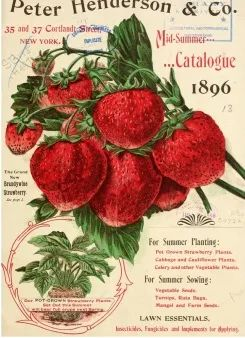
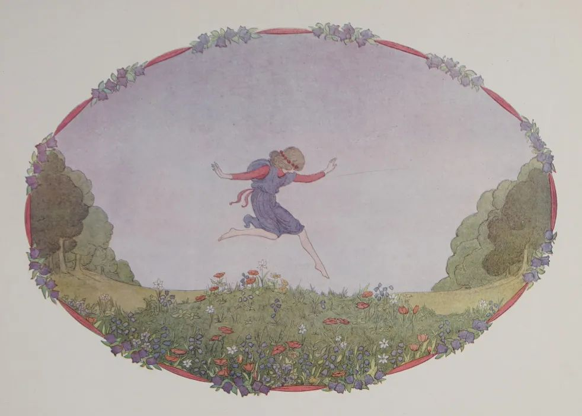
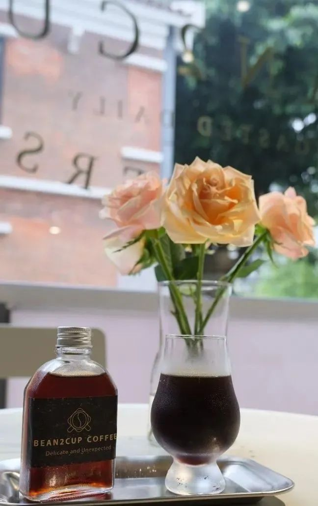
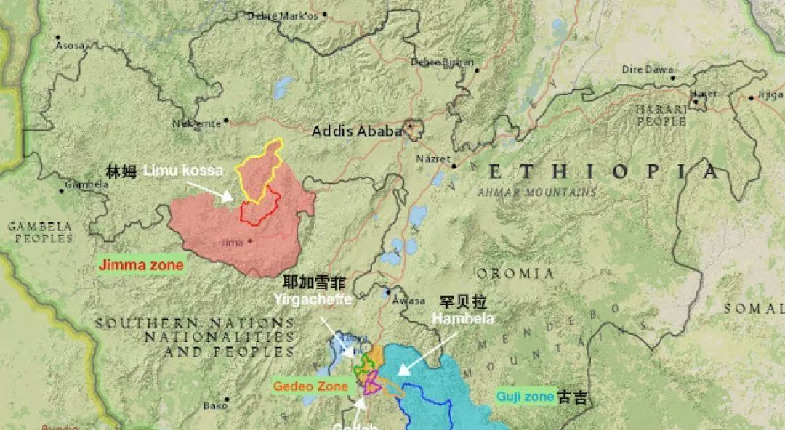
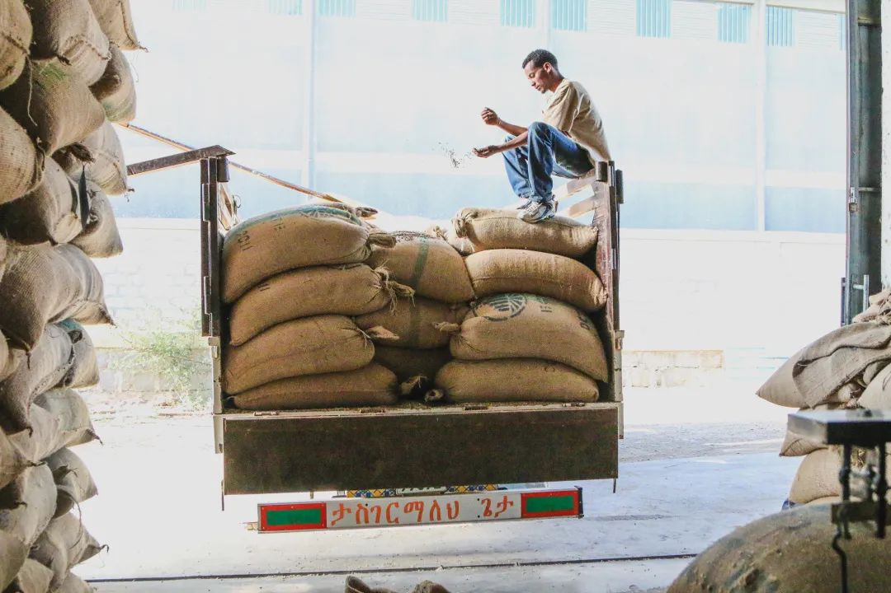
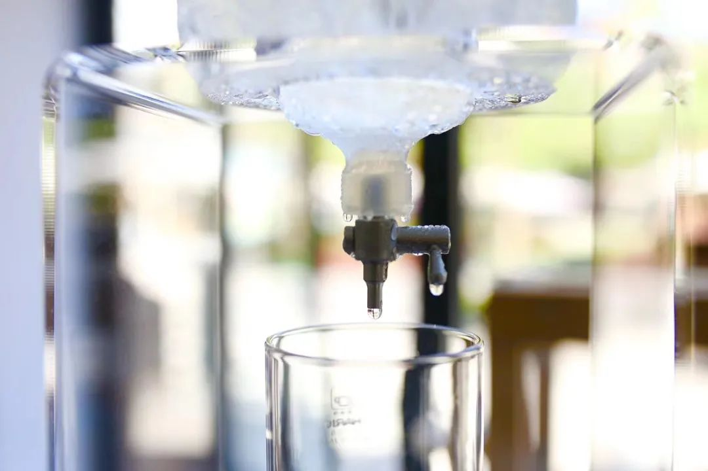
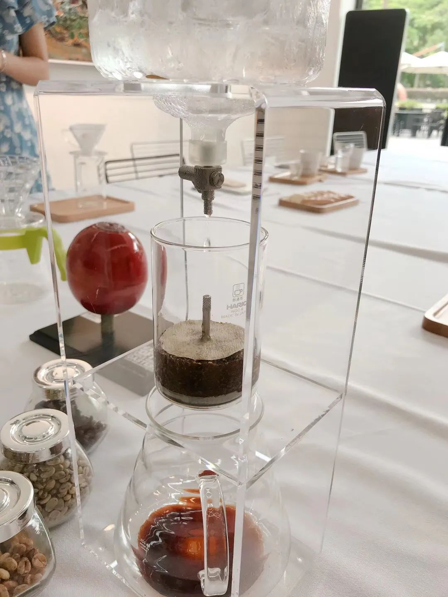
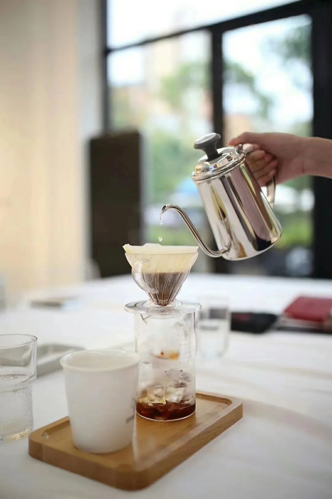

#  【新豆推荐】是她！我们的口粮

原创  BEAN2CUP

__ _ _ _ _

CHI  NA

BEAUTY

花魁5.0

** Bean2cup初夏推荐豆  **

**_ 花魁5.0  _ **

产国：非洲 · 埃塞俄比亚

产区：GUJI · HAMBELLA

处理方式：日晒

等级：Natural G1

庄园：布谷处理厂 Buku Abel

品种：Heirloom原生种

风味：玫瑰花、奶油草莓、

百香果、乌龙茶、太妃糖

**熟悉的老朋友-花中魁首**

相信很多啡友对花魁并不陌生，在2017年的埃塞俄比亚TOH大赛中，西达摩罕贝拉村的一支日晒豆一举夺冠，取名花魁。

【花魁】是属于埃塞俄比亚原生种，目前在罕贝拉产区约有不同规模处理厂近20家。

DW公司Hambella核心产区Dimtu有四家庄园处理厂，所有这些庄园和处理场中，  只有来自"Buku Abel
"庄园及处理厂出品的日晒咖啡称之为【花魁】。

**是她！我们的口粮**

在我心里一直觉得一支好豆子的衡量标准并不仅仅是层次、海拔、质感、口碑。。。。  诸如此类教科书般优秀的准则，而是能令人印象深刻的香气和特质。

埃塞俄比亚这款花中魁首，经久不衰，历经数年仍受啡友们热爱，当之无愧为优秀的三好学生！

** Bean2cup今年如约为广大啡友们奉上2021年新产季，新鲜滚热辣的花魁5.0  **

你们一直期待的老朋友又回来啦~

高级而不媚俗的花香，伴有玫瑰花气徐徐上升，跳跃在舌尖的奶油草莓。

它层次分明，绵延醇厚，风情万种。

新产季花魁，甜美粘稠的口感

与其说是玫瑰花，我更觉得像是玫瑰花酱、亦或是草莓酱与绵密奶油混合在一起的浓香顺滑。

中底温段香气慢慢没有那么霸道了，百香果的酸质出现，依然带着丝丝甘甜，却不腻，不刻意间闻到觉得十分迷人，终于明白为什么那么多人爱她。

真是一款能陪伴初夏明媚下午的豆子啊~

**产国 — 埃塞俄比亚**

埃塞俄比亚原生种Heirloom阿拉比卡咖啡源自於东非埃塞俄比亚，至今埃塞俄比亚境内还存在上百种、数千种的野生咖啡，甚至常年生长在原始森林中，无以数计在地衍生混合、突变、杂交一个大原生品种库，这种在地混种称为阿拉比卡的基因库。

**产区 — 古吉 · 罕贝拉**

古吉（Guji）咖啡豆产区
古吉产区原本属于西达摩产区，因为其与耶加雪菲一样具有独特的产区风味而独立出来，西达摩花魁系列咖啡豆就产自古吉产区的子产区罕贝拉

古吉(Guji)产区位在生产西达莫的Gedeo地区东南方，海拔2100公尺的旷野，但比起耶加产区海拔更高，最高海拔超过2600公尺，也比一般的Sidama高许多，面积更广。

**冲泡建议**

Bean2cup咖啡师冲泡感受

用V60滤杯，三段式冲煮发挥稳定。有明显的玫瑰花酱和奶油感，甜度高。高温时酸度较低，稍微晾凉一下风味更明显。

花魁的甜感和粘稠度都很好，但希望得到更加均匀风味的啡友，可以尝试用46冲煮法去提高平衡度。

Bean2cup本月冲泡方式

夏季炎热，我们尝试用冰滴萃取花魁，低温萃取的冰滴咖啡，经过静置发酵后有明显的白桃、乌龙茶、草莓香气。

慢速冰滴之后，建议放在冰箱里静置48小时以上，让萃取出来的咖啡液体在低温环境有一个缓慢发酵的过程，使得咖啡香气更加融合。

想要一品花魁5.0醇香的冰滴的朋友，欢迎来到Bean2cup海珠门店！

在家里没有冰滴条件的朋友，也可以用滤杯冰冲的方式。比方说18g的粉就用120g的冰,92摄氏度的水，总注水量160g（研磨度可以适当调细一丢丢，注水要慢一点）。

感兴趣的小伙伴欢迎长按购买链接砸单~

**
**

**/ 良心推荐清单回顾 /**

[ 2021年5月课程 | 广州课堂-- SCA黄金杯和咖啡师初中级开始报名啦~ ](http://mp.weixin.qq.com/s?__biz=MzAwNTYzODcxMg==&mid=2651352452&idx=1&sn=70b91799b96fe2b98a69bc64c59d4fd1&chksm=80e552d3b792dbc5252e90b1126c9b6991a2b73b1b245c3378f2db7ebf776611af95f21e322d&scene=21#wechat_redirect)

[ 春日新豆推荐/卢旺达-山竹
](http://mp.weixin.qq.com/s?__biz=MzAwNTYzODcxMg==&mid=2651352128&idx=1&sn=e5dc23ad84686d25a78a14e79f09869e&chksm=80e55317b792da018542bb196d1d6004e8cbba6b22b07939df6aace55f164803d4953682601b&scene=21#wechat_redirect)

[ 【咖啡穿梭机】请乘客们登机
](http://mp.weixin.qq.com/s?__biz=MzAwNTYzODcxMg==&mid=2651352386&idx=1&sn=8756b4da35eba64f14be39be24c14a5f&chksm=80e55215b792db03570f8b8aaa58630daa1f5cc27c7ea5656591b19d2ec073deaff7d540a5f5&scene=21#wechat_redirect)

[ 保持热爱，奔赴山林 ——云南游学回顾
](http://mp.weixin.qq.com/s?__biz=MzAwNTYzODcxMg==&mid=2651351216&idx=1&sn=b9350668d819be08be21ba81b984604b&chksm=80e557e7b792def10fc9ce9822e40ea2cad08d2ce788e90a1fd8d7ba57190b8d6e409e17dec0&scene=21#wechat_redirect)

[ Bean2cup 招纳小伙伴
](http://mp.weixin.qq.com/s?__biz=MzAwNTYzODcxMg==&mid=2651352419&idx=1&sn=4a1cc5af14af1d705c4f77371c2378a5&chksm=80e55234b792db22ce6a5812c25490f2b05e2b84122045202492163be78049e4933538e63235&scene=21#wechat_redirect)

预览时标签不可点

微信扫一扫
关注该公众号

****

****

×  分析

__

微信扫一扫可打开此内容，
使用完整服务

：  ，  ，  ，  ，  ，  ，  ，  ，  ，  ，  ，  ，  。  视频  小程序  赞  ，轻点两下取消赞  在看  ，轻点两下取消在看
分享  留言  收藏  听过

