#  【豆子推荐】竞拍独家 - 拾叁

原创  BEAN2CUP

__ _ _ _ _

**拾叁**

冬季呈献 · 竞拍独家批次

Bean2cup Coffee

**拾叁· 哥斯达黎加**

新鲜产季的独家批次

产国：南美洲 · 哥斯达黎加

产区：中央山谷 San Rafael

咖啡庄园：La Union

种植海拔：1500m

处理方式：白蜜处理

品种：SL28

独家批次：EEVC2021 #13

评分：90.34

风味：乌梅、果香、甘蔗、焦糖、余韵悠长

** · 风味 ·
**

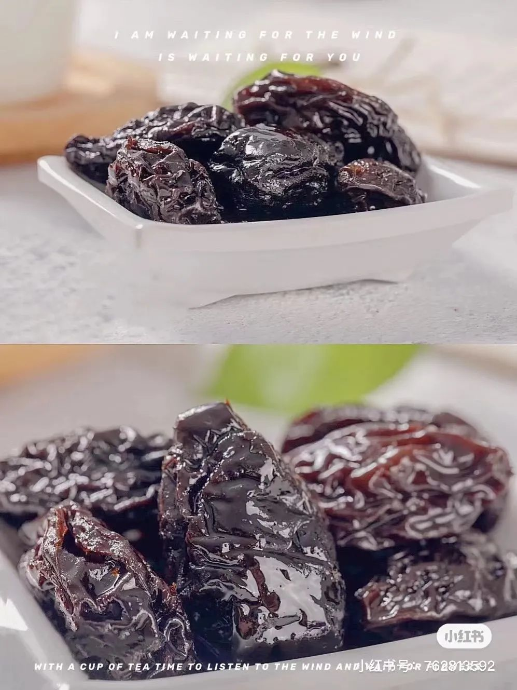

● **乌梅+甘蔗**

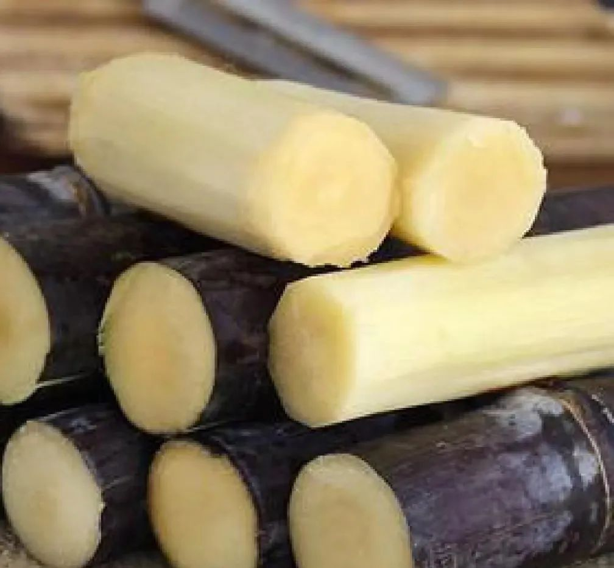

余韵悠长，滴滴饱满

**“自然万物皆是道，心造大千”**

ALL EMBRACING

初闻干香是比较浓郁的干制水果味，湿香带有隐约的莓果气息。第一段注水后，香气明显清甜很多，干香时闻到的发酵感慢慢减弱，取而代之的是甘蔗焦糖类的香甜味道。

整体乌梅感很强，入口回甘，余韵也很绵软。

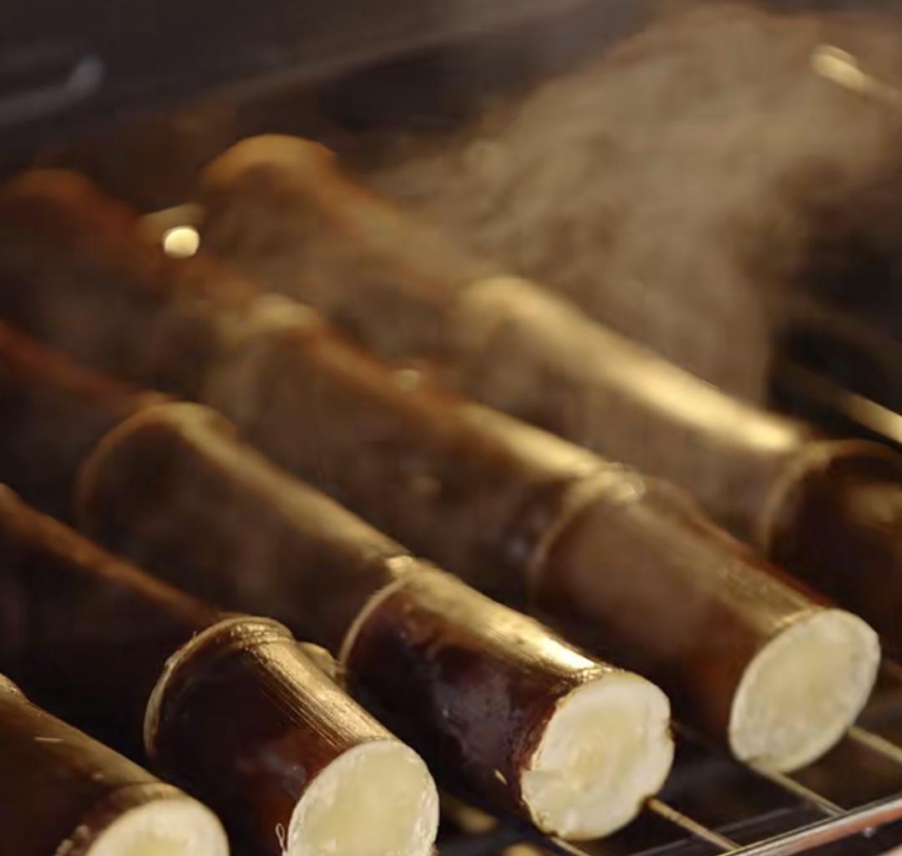

如果你在的城市会下雪，这杯咖啡甜蜜的焦糖味就像炉火旁的热气一样，从背后环抱你

诱人的香甜下弥漫着原始朴素的质感。

山脊上薄薄的一层白雪，在小木屋或者竹林边的营帐，拿出一小碟用乌梅腌渍过的小番茄，挨着灶火搓搓手，捏着老师刚发的诗卷，细细咀嚼一字一行。诗人眼里的大地会歌唱，仿佛有无形的手带领我们洞察世界。感官无限放大，像每一秒都在用新的视角看见人间。

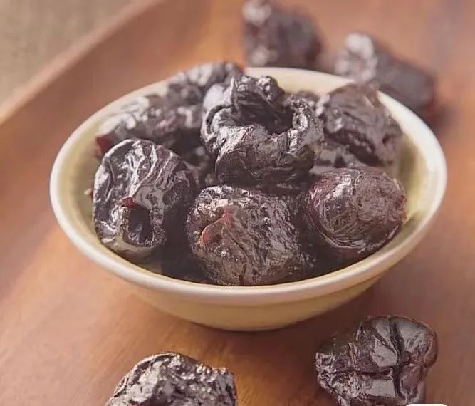

** ·白蜜处理法 ·
**

● **果胶的百分之二十**

**“蜜处理的起源地”**

BEGINNING OF HONEY PROCESSING

到了2000年代中、晚期，蜜处理豆（Miel Process）这个风潮从哥斯达黎加开始兴起,通过技术的不断革新，逐渐演变为现在的蜜处理（Honey
Processing）

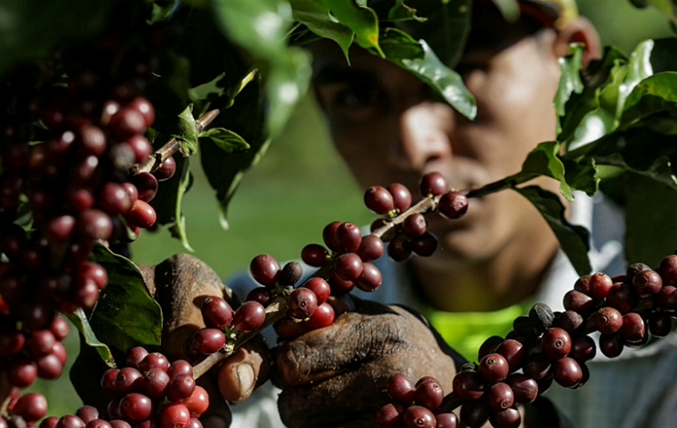

蜜处理简单来说就是让咖啡樱桃去除果皮后，带着果胶进行日晒干燥。这层果胶是咖啡果实糖份含量最高的部分，粘稠像蜂蜜般的物质，内含有丰富的糖分和酸度。这些宝贝也是后面给咖啡生豆带来丰富味道的来源。蜜处理中还有白、黄、红、黑的细分。

白蜜20%-40%（果胶保留程度）

黄蜜40%-60%

红蜜60%-80%

黑蜜80%-100%

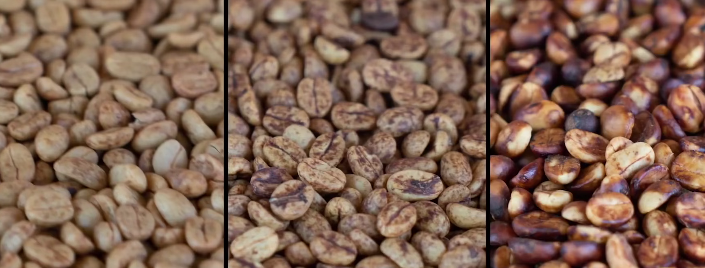

蜜处理的出现很好的平衡了哥斯达黎加咖啡豆原本的酸质特性。它有别于传统的水洗，从去果皮到晾晒都有严格的工艺步骤。

随着科技的进步，现在一些庄园会使用更精密的去果皮机器，来决定保留的果胶程度。还有一种做法是干预发酵的程度，方法有：

干燥速度、光照情况、铺晒厚度、翻动次数、场地情况等。统称干燥曲线。

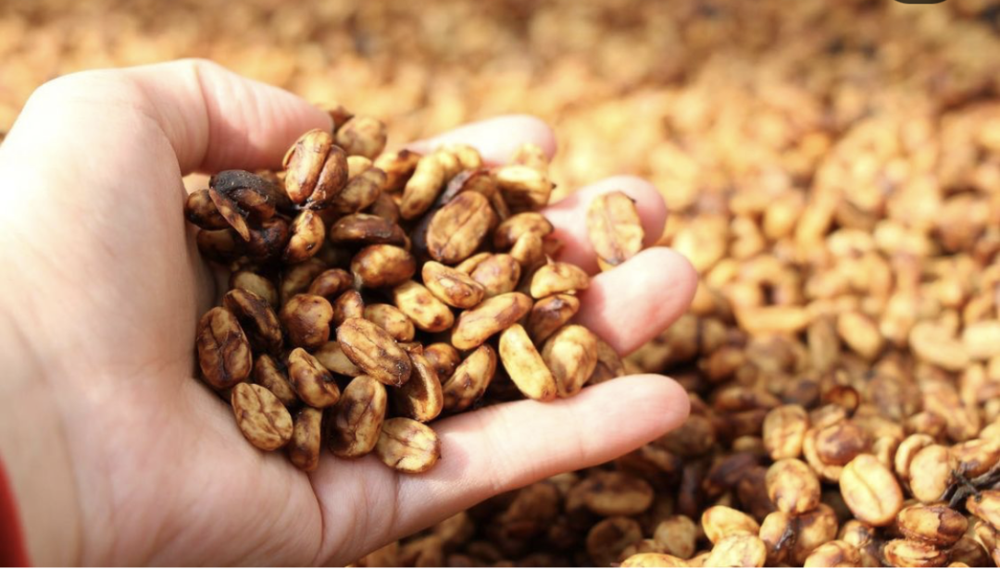

其中白蜜处理就处于水洗和蜜处理之间，可以说是兼顾了两者的优点。在果胶赋予的甜感和轻微发酵下的芳香物质，又比一般的蜜处理豆子来的更加干净纯粹，酸质平衡。

** 竞拍独家批次#13
**

● **独家竞拍批次**

**“EEVC竞拍活动”**

Exclusive & Exotic Varietal Collection 2021

哥斯达黎加咖啡庄园主为了庆祝、促进新一代的咖啡人在新品种、更优风味作出的不断努力，咖啡家族们和咖啡生产者们自发的组织了这场拍卖活动。

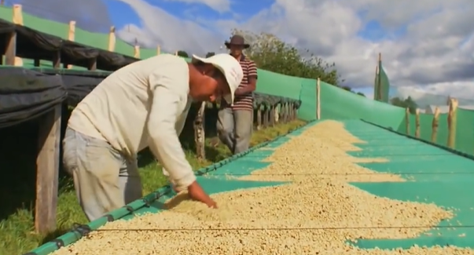

这次拍卖也代表着哥斯达黎加多年来怀着更高目标、包含激情与多年的耐心致力于咖啡工作的成果。也彰显着拥有着200年历史的哥斯达黎加咖啡实力。

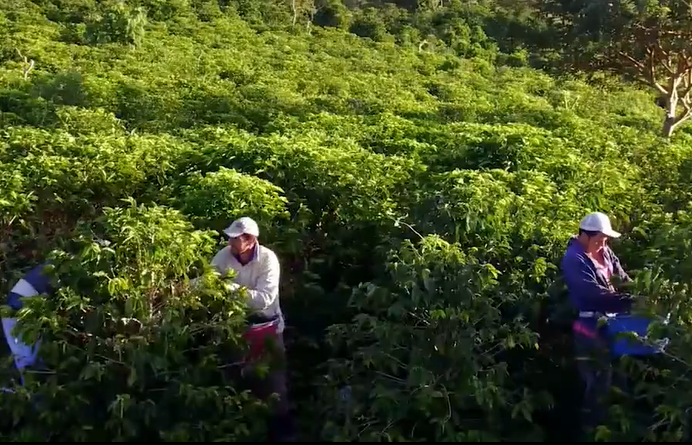

通过Q
Grading团队与精品咖啡生产商紧密合作，组织了这场拍卖，关注在风味、复杂多样的品种，给予基因遗产重生的机会，40个超微批次，同时通过品尝这些独特多样的咖啡，让消费者对哥伦比亚咖啡有更深层的认知。

**· 哥斯达黎加 ·**

● **和平**

**“拥抱爱与和平的国度”**

COSTA RICA

哥斯达黎加是世界上第一个解除军备的国家，也是中美洲最早开始种植咖啡的国家。因为高海拔加上丰富的微气候十分适合咖啡树生长，所以咖啡农业是他们国内最主要的产业之一。哥斯达黎加的咖啡庄园代代传承，很多都是家族产业，相传六七代人。因为政府的法例规定，哥斯达黎加全境种植的都是优质的阿拉比卡树种。

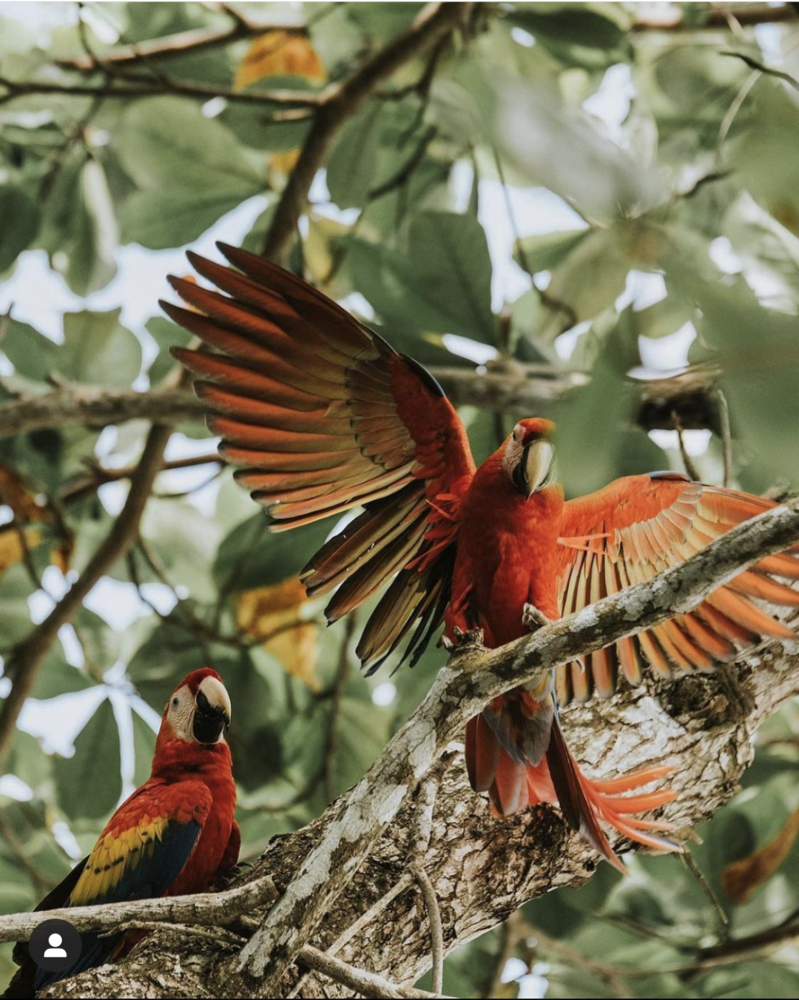

哥斯达黎加最有名的三大产地：首都圣何塞南部的塔拉珠，以及中央山谷和西部山谷的产区。

其中分布着许多优秀的独立庄园，哥斯达黎加咖啡一直被认为是完美类型的经典风味，平衡、干净、温和是它的基调。余韵上会有显著的咖啡花香味，是一款充满拉丁乡村风情的闲静咖啡。

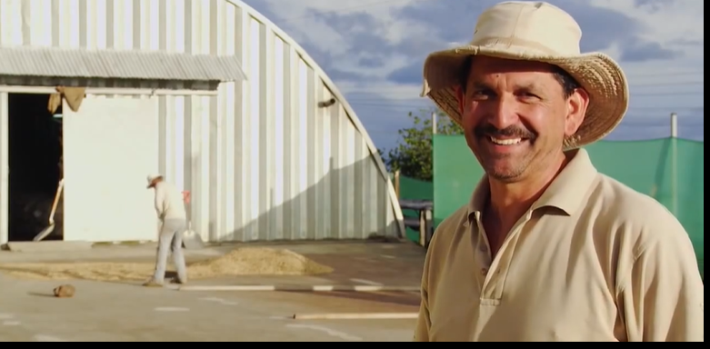

哥斯达黎加的人民的十分热情可爱，他们的国民格言是“工作与和平万岁！”

不难想象在这样丰饶的土地上，品尝到一杯新鲜的咖啡会是何等的舒适惬意。

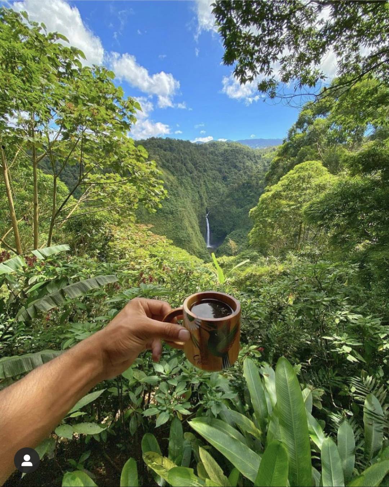

** · SL28 ·
**

● **波旁嫡系**

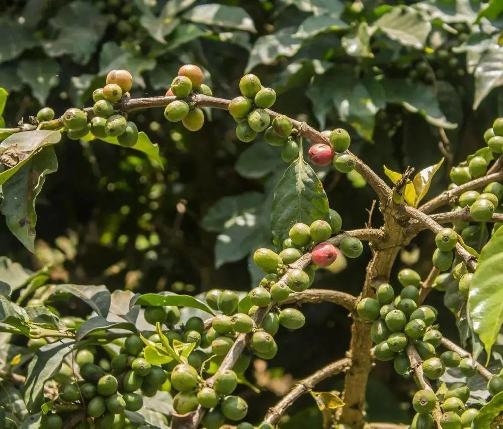

**“需要悉心照料的波旁子孙”**

Scott Laboratories

SL代表Scott Labs(斯科特实验室）

二十世纪三十年代，斯科特实验室受肯尼亚政府委托，进行咖啡育种分类方面的研究，试图寻找能够适应肯尼亚风土、可用于大规模种植、拥有商业价值的品种。SL-28，SL-34是众多研究成果中的两只。

SL系列是基于也门摩卡古种以及留尼汪岛的波旁种进行研究选育而成，相对而言，SL-28获得的声誉更高，圆身厚实的豆子有着很棒的甜感、平衡感和复杂多变的风味，以及显着的柑橘、乌梅特色。

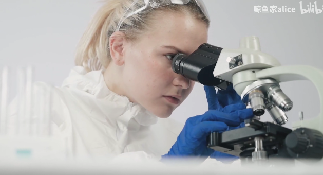

当生长在中高海拔时（SL品种在海拔700米及以上生长最好），这些植物成熟缓慢且充分，生产出高质量、浓郁的咖啡，具有良好的酸度和坚果、水果的味道。然而SL28的成长过程较容易受到咖啡叶锈病、咖啡樱桃病（CBD）和土壤线虫的影响。需要咖农的悉心照顾，但产量的回报也是相对的。

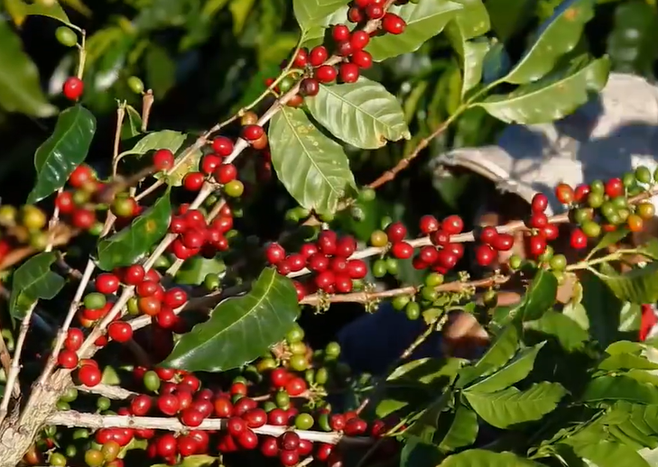

** · 冲泡建议 ·
**

● **豆本咖啡**

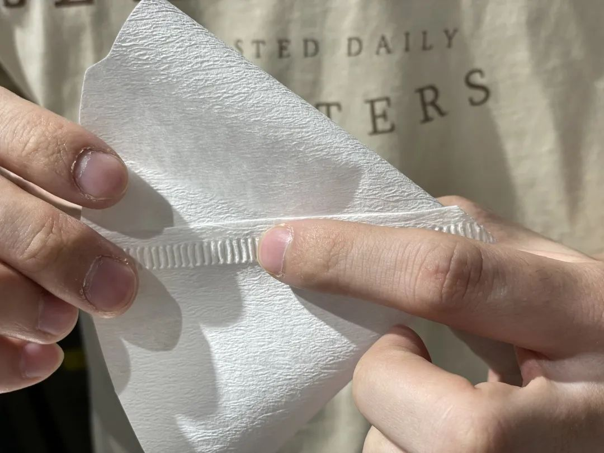

Bean2cup Coffee

**“咖啡师碎碎念”**

滤杯：V60或蛋糕杯

水质：TDS 80-110

水温：92摄氏度

水粉比例 1:16

冲煮时间：2分30-45秒

总注水量260ml，建议在200ml时候进行截流。三段式的冲煮手法，前两段注水轻柔，中段多些搅拌增加甜感，在2分30秒时加大水流收尾。

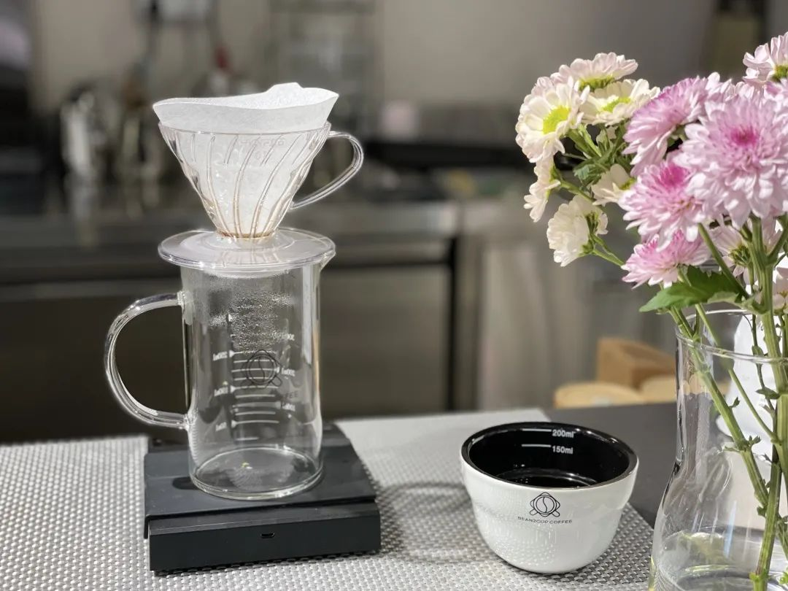

有条件的小伙伴们可以做一盘乌梅渍小番茄搭配着一杯香浓的哥斯达黎加咖啡，惬意得很呀！

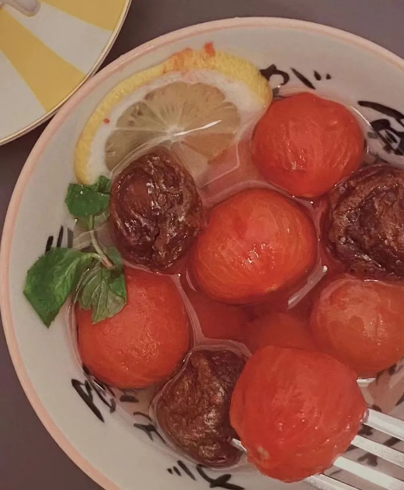

** 哥斯达黎加白蜜处理 — 拾叁  **

** 将会在12月16-18号的广州咖啡展上线
**

** 新豆子原价￥328/200g  **

** 展会优惠价￥288/200g  **

** 更多展会优惠~敬请关注~  **

Bean2cup海珠旗舰店同步上线

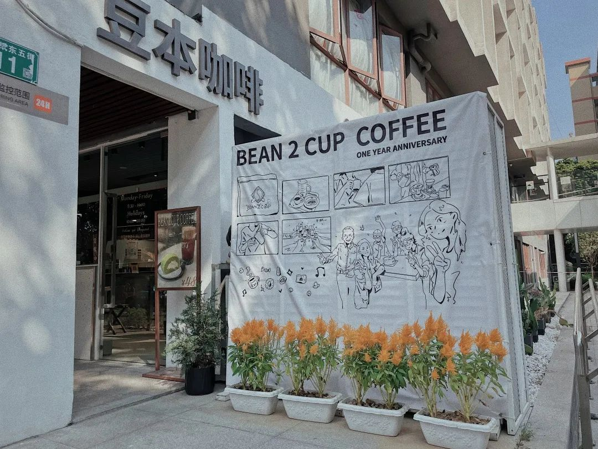

感兴趣的小伙伴们也可以猛戳链接购买

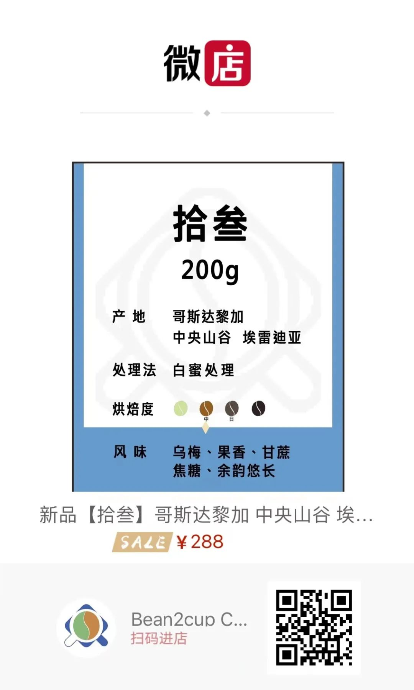

**完**

**/ 往期推荐回顾 /**

[ 一次游学，二级SCA生豆课程，三天深度探索，四种咖啡处理法| 云南咖啡游学开始报名啦～
](http://mp.weixin.qq.com/s?__biz=MzAwNTYzODcxMg==&mid=2651355361&idx=1&sn=11193b7efb433a10483aaadb39643941&chksm=80e547b6b792cea0d735f4c421795ecc752050b33d0af9ad383b17f637dd96526949bd60c252&scene=21#wechat_redirect)

[ 2021年12月兴趣班课程 | 广州拉花兴趣班课程 ](http://mp.weixin.qq.com/s?__biz=MzAwNTYzODcxMg==&mid=2651354964&idx=1&sn=1abc0963d451963e98324af5369de60a&chksm=80e54803b792c11577a010d0886ee0486dbc83f2668569b7103a17f4b4da5938c55f78b8a55a&scene=21#wechat_redirect)

[ 2021年12月兴趣班课程 | 深圳拉花兴趣班课程 ](http://mp.weixin.qq.com/s?__biz=MzAwNTYzODcxMg==&mid=2651354964&idx=2&sn=a8214f1c2b977570182579757ddf95c5&chksm=80e54803b792c115204872a036bfb0820e39720e6df215be557387f95454a5a75f65244d0862&scene=21#wechat_redirect)

[ 8周年「光影」| 光影下的你我它
](http://mp.weixin.qq.com/s?__biz=MzAwNTYzODcxMg==&mid=2651353916&idx=1&sn=e41271b39cd20a2c9bc46b5f00f565c9&chksm=80e54c6bb792c57d887b591e0e73dde8928caa7c5cbf364df046494ae8877f2935693638c313&scene=21#wechat_redirect)

[ 【豆子推荐】孔加双重厌氧 - 茶玫瑰
](http://mp.weixin.qq.com/s?__biz=MzAwNTYzODcxMg==&mid=2651353574&idx=1&sn=0b505e726640f58368f9b21e5ac3e575&chksm=80e54eb1b792c7a7f64b70db8251015bb2a8b90edc105653c5c12d53e964912b387a4406bcc7&scene=21#wechat_redirect)

[ 【豆子推荐】秘鲁有机咖啡
](http://mp.weixin.qq.com/s?__biz=MzAwNTYzODcxMg==&mid=2651353321&idx=1&sn=03d246dc8f8853316cd9d98a34ee240d&chksm=80e54fbeb792c6a8bfe9f166788495ed8987b086493b8fa56ab59977d78c6c109d2f2f89f5af&scene=21#wechat_redirect)

[ 【豆子推荐】小溪庄园瑰夏-欢颜
](http://mp.weixin.qq.com/s?__biz=MzAwNTYzODcxMg==&mid=2651352822&idx=1&sn=d7db9b0ff38fcf8e0030cc590b3bef06&chksm=80e551a1b792d8b79895374590581200dc4872e0fa9fcc28413f59943568ca4fb3041c4eb586&scene=21#wechat_redirect)

[ 【新豆推荐】是她！我们的口粮
](http://mp.weixin.qq.com/s?__biz=MzAwNTYzODcxMg==&mid=2651352674&idx=1&sn=82743cc4215db6c36670a76a4fe8d96b&chksm=80e55135b792d8237b4ebec87131a31d474c3244b04e9627718fef8b8fe855394bee5586e78e&scene=21#wechat_redirect)

[ 保持热爱，奔赴山林 ——云南游学回顾
](http://mp.weixin.qq.com/s?__biz=MzAwNTYzODcxMg==&mid=2651352674&idx=1&sn=82743cc4215db6c36670a76a4fe8d96b&chksm=80e55135b792d8237b4ebec87131a31d474c3244b04e9627718fef8b8fe855394bee5586e78e&scene=21#wechat_redirect)

[ 【新豆推荐】耶加雪菲 - 荷花G1
](http://mp.weixin.qq.com/s?__biz=MzAwNTYzODcxMg==&mid=2651352230&idx=1&sn=d2890695b7aac51d8170d19a9d9afdbf&chksm=80e553f1b792dae776396ec1c9112b2356f0e204c23781215e185b6f263883d4093cab8cd853&scene=21#wechat_redirect)

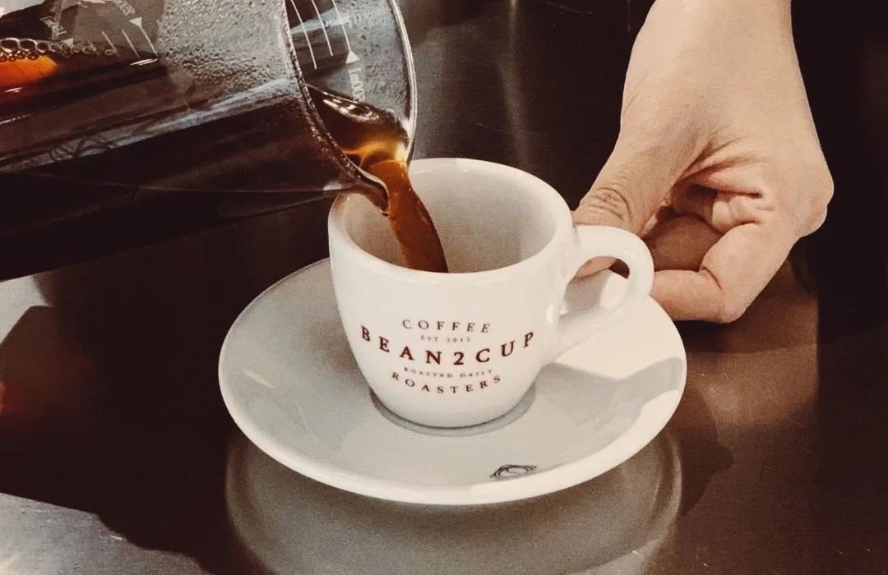

